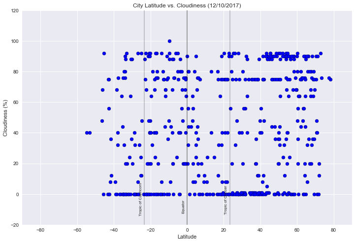

# WeatherPy

### Analysis
* OBSERVED TREND 1: The process selected 533 unique cities. On 12/10/2017, the highest temperature was recorded in Santiago del Estero, Argentina at 99.73˚F. The lowest temperature recorded was Ust-Nera, Russia at -44.73˚F. Generally, the highest global temperatures were within the tropics.(The band of latitudes ranging from 23.5˚ south (Tropic of Capricorn) to 23.5˚ north (Tropic of Cancer.)) The two highest temperature points were measured south of the Tropic of Capricorn, which is consistent with the season, as we are approaching the summer solstice in the Southern Hemisphere. Temperatures dropped sharply north of the Tropic of Cancer; all of the below freezing (32˚F) temperatures were in this region. This is consistent with the season, as we are approaching the winter solstice in the Northern Hemisphere.
* OBSERVED TREND 2: On 12/10/2017, the highest wind speed recorded was 47.2 mph in Punta Arenas, Chile, south of the Tropic of Capricorn. The next 6 highest wind speed measurements were recorded north of the Tropic of Cancer. Generally, wind speeds appear to be higher north and south of the tropics, and lower within the tropics. There also appears to be some correlation between coastal locations and wind speeds; wind speed appears to be higher in coastal locations, and lower inland.
* OBSERVED TREND 3: On 12/10/2017, humidity was consistently higher in the tropics, and lower north of the Tropic of Cancer, and south of the Tropic of Capricorn. There appears to be some correlation between coastal locations and humidity; humidity appears to be higher in coastal locations, and lower inland. Cloudiness appears to be distibuted fairly evely around the globe. There was only one location with 100% cloudiness, (Liwale, Tanzania) while there were 130 location with 0% cloudiness.


###### Developer notes and caveats:
* Looking at the assignment, my strategy was to select a set of random uniform coordinates ranged using the minimum and maximum latitude and longitude coordinates of the planet. I used integers for these, as I wanted to remove duplicates before calling the citipy nearest city functionality. Logically, the citipy library will return many duplicates, as the random coordinates set will contain locations in the water, and citipy will return the same nearest city for diverse in-the-water coordinates.
* I was not happy with the latitude xlims of -80, +100 in the example document, so I restored them to -90, +90. Also, the wind speed ylim of 40 shown in the example document excluded my max wind speed, so I adjusted it to 50.
* Finally, I have added some additional features to the assignment, as I believe that they help to visualize the data. I cleared this with Ben Fuja before submitting the assignment.

#### Dependencies


```python
import numpy as np                                                           # numpy library
```


```python
import pandas as pd                                                          # pandas library
```


```python
import matplotlib.pyplot as plt                                              # pyplot module from matplotlib library
```


```python
import matplotlib.patches as mpatches                                        # patches module from matplotlib library
```


```python
import seaborn as sns                                                        # seaborn library
```


```python
from citipy import citipy                                                    # citipy module from citipy library
```


```python
from random import uniform                                                   # uniform module from random library
```


```python
import requests                                                              # requests library
```


```python
from datetime import datetime                                                # datetime module from datetime library
```


```python
import time                                                                  # time library, api call compliance
```


```python
def newcoord():
    """ newcoord function
    Args: None
    Returns: tuple of integers (int) representing x and y coordinates
    x random unifrom distribution between -90 and 90 (latitude)
    y random uniform distribution between -180 and 180 (longitude)
    """
    return (int(uniform(-90,90)), int(uniform(-180, 180)))
```


```python
coords = []                                                                  # initializes empty list 
```


```python
# creates generator object containing 1600 sets of random latitude and longitude coordinates
# 1600 selected becuase it consistently provides city list over 500 once duplicates are removed
x_and_y = (newcoord() for x in range(1600))
```


```python
for coord in x_and_y:                                                        # iterates through generator
    coords.append(coord)                                                     # appends tuple to list
```


```python
unique_coords = set(coords)                                                  # casts to set to remove duplicates
```


```python
len(unique_coords)                                                           # checks length of set (s/b < 1600)
```


    1576


#### Generate Cities List


```python
cities = []                                                                  # initializes empty list 
```


```python
for coord_tup in unique_coords:                                              # iterates through list
    lat, lng = coord_tup                                                     # unpacks tuple
    cities.append(citipy.nearest_city(lat, lng))                             # appends citipy object to list
```


```python
unique_cities = set(cities)                                                  # casts to set to remove duplicates
```


```python
len(unique_cities)                                                           # checks length of set (s/b > 500)
```


    641


```python
# creates an initial dataframe using list comprehensions
cities_df = pd.DataFrame({'City': [city.city_name for city in unique_cities], 
                          'Country': [city.country_code.upper() for city in unique_cities]})
```


```python
cities_df['Cloudiness'] = ''                                                 # adds columns to be filled by API calls
cities_df['Date'] = ''
cities_df['Humidity'] = ''
cities_df['Lat'] = ''
cities_df['Lng'] = ''
cities_df['Max Temp'] = ''
cities_df['Wind Speed'] = ''
```

#### Perform API Calls


```python
records = 0                                                                  # initializes record counter
max_calls = 50                                                               # used to prevent exceeding API limit
sets = 1                                                                     # initializes set counter
```


```python
endpoint = 'http://api.openweathermap.org/data/2.5/weather'                  # base URL for API calls
units = 'imperial'                                                           # specifies Fahrenheit temperatures 
api_key = '38b8308a2133ec338a39cf692b1a7ce3'                                 # API key provided by service

params = {                                                                   # Build partial query URL
    'appid': api_key,
    'units': units
}
```


```python
print("-----------------------------------------------------------")         # displays API call header
print("Beginning Data Retrieval")
print("-----------------------------------------------------------")

for index, row in cities_df.iterrows():                                      # iterates through rows of dataset
    if records == max_calls:
        time.sleep(60)                                                       # pause, API compliance
        sets += 1                                                            # increments set counter
        records = 0                                                          # resets record counter
    
    params['q'] = row['City'] + ',' + row['Country']                         # adds city and country to parameters
    a, u, q = params.values()                                                # unpacks parameters for display
    
    displayurl = endpoint + '?' + 'appid=' + a + '&units=' + u + '&q=' + q   # concatenates display URL
        
    # displays record status and display URL
    print("Processing Record " + str(records) + " of Set " + str(sets) + " | " + q)
    print(displayurl)
        
    try:                                                                     # exception handing for city not found
        response = requests.get(endpoint, params=params).json()              # API call
        
    except:
        print(q + ": City not found, Skipping...")                           # city not found
        
    try:                                                                     # exception handling for missing data
        cities_df.set_value(index, 'Cloudiness', response['clouds']['all'])
        dv = datetime.fromtimestamp(int(response['dt'])).strftime('%m/%d/%Y')
        cities_df.set_value(index, 'Date', dv)
        cities_df.set_value(index, 'Humidity', response['main']['humidity'])
        cities_df.set_value(index, 'Lat', response['coord']['lat'])
        cities_df.set_value(index, 'Lng', response['coord']['lon'])
        cities_df.set_value(index, 'Max Temp', response['main']['temp_max'])
        cities_df.set_value(index, 'Wind Speed', response['wind']['speed'])
        
    except:
        print(q + ": Missing Data...")                                       # city missing data
    records += 1
        
print("-----------------------------------------------------------")         # displays API call footer       
print("Data Retrieval Complete")
print("-----------------------------------------------------------")
```

    -----------------------------------------------------------
    Beginning Data Retrieval
    -----------------------------------------------------------
    Processing Record 0 of Set 1 | andenes,NO
    http://api.openweathermap.org/data/2.5/weather?appid=38b8308a2133ec338a39cf692b1a7ce3&units=imperial&q=andenes,NO
    Processing Record 1 of Set 1 | mount isa,AU
    http://api.openweathermap.org/data/2.5/weather?appid=38b8308a2133ec338a39cf692b1a7ce3&units=imperial&q=mount isa,AU
    Processing Record 2 of Set 1 | coquimbo,CL
    http://api.openweathermap.org/data/2.5/weather?appid=38b8308a2133ec338a39cf692b1a7ce3&units=imperial&q=coquimbo,CL
    Processing Record 3 of Set 1 | tawang,IN
    http://api.openweathermap.org/data/2.5/weather?appid=38b8308a2133ec338a39cf692b1a7ce3&units=imperial&q=tawang,IN
    Processing Record 4 of Set 1 | ahipara,NZ
    http://api.openweathermap.org/data/2.5/weather?appid=38b8308a2133ec338a39cf692b1a7ce3&units=imperial&q=ahipara,NZ
    Processing Record 5 of Set 1 | moron,CU
    http://api.openweathermap.org/data/2.5/weather?appid=38b8308a2133ec338a39cf692b1a7ce3&units=imperial&q=moron,CU
    Processing Record 6 of Set 1 | kuala selangor,MY
    http://api.openweathermap.org/data/2.5/weather?appid=38b8308a2133ec338a39cf692b1a7ce3&units=imperial&q=kuala selangor,MY
    Processing Record 7 of Set 1 | saint-philippe,RE
    http://api.openweathermap.org/data/2.5/weather?appid=38b8308a2133ec338a39cf692b1a7ce3&units=imperial&q=saint-philippe,RE
    Processing Record 8 of Set 1 | bayir,JO
    http://api.openweathermap.org/data/2.5/weather?appid=38b8308a2133ec338a39cf692b1a7ce3&units=imperial&q=bayir,JO
    bayir,JO: Missing Data...
    Processing Record 9 of Set 1 | niquero,CU
    http://api.openweathermap.org/data/2.5/weather?appid=38b8308a2133ec338a39cf692b1a7ce3&units=imperial&q=niquero,CU
    Processing Record 10 of Set 1 | mys shmidta,RU
    http://api.openweathermap.org/data/2.5/weather?appid=38b8308a2133ec338a39cf692b1a7ce3&units=imperial&q=mys shmidta,RU
    mys shmidta,RU: Missing Data...
    Processing Record 11 of Set 1 | bengkulu,ID
    http://api.openweathermap.org/data/2.5/weather?appid=38b8308a2133ec338a39cf692b1a7ce3&units=imperial&q=bengkulu,ID
    Processing Record 12 of Set 1 | jinotega,NI
    http://api.openweathermap.org/data/2.5/weather?appid=38b8308a2133ec338a39cf692b1a7ce3&units=imperial&q=jinotega,NI
    Processing Record 13 of Set 1 | bowen,AU
    http://api.openweathermap.org/data/2.5/weather?appid=38b8308a2133ec338a39cf692b1a7ce3&units=imperial&q=bowen,AU
    Processing Record 14 of Set 1 | katha,MM
    http://api.openweathermap.org/data/2.5/weather?appid=38b8308a2133ec338a39cf692b1a7ce3&units=imperial&q=katha,MM
    katha,MM: Missing Data...
    Processing Record 15 of Set 1 | aras,NO
    http://api.openweathermap.org/data/2.5/weather?appid=38b8308a2133ec338a39cf692b1a7ce3&units=imperial&q=aras,NO
    aras,NO: Missing Data...
    Processing Record 16 of Set 1 | biak,ID
    http://api.openweathermap.org/data/2.5/weather?appid=38b8308a2133ec338a39cf692b1a7ce3&units=imperial&q=biak,ID
    biak,ID: Missing Data...
    Processing Record 17 of Set 1 | novobiryusinskiy,RU
    http://api.openweathermap.org/data/2.5/weather?appid=38b8308a2133ec338a39cf692b1a7ce3&units=imperial&q=novobiryusinskiy,RU
    Processing Record 18 of Set 1 | pangoa,PE
    http://api.openweathermap.org/data/2.5/weather?appid=38b8308a2133ec338a39cf692b1a7ce3&units=imperial&q=pangoa,PE
    Processing Record 19 of Set 1 | pangnirtung,CA
    http://api.openweathermap.org/data/2.5/weather?appid=38b8308a2133ec338a39cf692b1a7ce3&units=imperial&q=pangnirtung,CA
    Processing Record 20 of Set 1 | broken hill,AU
    http://api.openweathermap.org/data/2.5/weather?appid=38b8308a2133ec338a39cf692b1a7ce3&units=imperial&q=broken hill,AU
    Processing Record 21 of Set 1 | bluff,NZ
    http://api.openweathermap.org/data/2.5/weather?appid=38b8308a2133ec338a39cf692b1a7ce3&units=imperial&q=bluff,NZ
    Processing Record 22 of Set 1 | touros,BR
    http://api.openweathermap.org/data/2.5/weather?appid=38b8308a2133ec338a39cf692b1a7ce3&units=imperial&q=touros,BR
    Processing Record 23 of Set 1 | henties bay,NA
    http://api.openweathermap.org/data/2.5/weather?appid=38b8308a2133ec338a39cf692b1a7ce3&units=imperial&q=henties bay,NA
    henties bay,NA: Missing Data...
    Processing Record 24 of Set 1 | nam tha,LA
    http://api.openweathermap.org/data/2.5/weather?appid=38b8308a2133ec338a39cf692b1a7ce3&units=imperial&q=nam tha,LA
    nam tha,LA: Missing Data...
    Processing Record 25 of Set 1 | quatre cocos,MU
    http://api.openweathermap.org/data/2.5/weather?appid=38b8308a2133ec338a39cf692b1a7ce3&units=imperial&q=quatre cocos,MU
    Processing Record 26 of Set 1 | broome,AU
    http://api.openweathermap.org/data/2.5/weather?appid=38b8308a2133ec338a39cf692b1a7ce3&units=imperial&q=broome,AU
    Processing Record 27 of Set 1 | chokurdakh,RU
    http://api.openweathermap.org/data/2.5/weather?appid=38b8308a2133ec338a39cf692b1a7ce3&units=imperial&q=chokurdakh,RU
    Processing Record 28 of Set 1 | srednekolymsk,RU
    http://api.openweathermap.org/data/2.5/weather?appid=38b8308a2133ec338a39cf692b1a7ce3&units=imperial&q=srednekolymsk,RU
    Processing Record 29 of Set 1 | nelson bay,AU
    http://api.openweathermap.org/data/2.5/weather?appid=38b8308a2133ec338a39cf692b1a7ce3&units=imperial&q=nelson bay,AU
    Processing Record 30 of Set 1 | pitimbu,BR
    http://api.openweathermap.org/data/2.5/weather?appid=38b8308a2133ec338a39cf692b1a7ce3&units=imperial&q=pitimbu,BR
    Processing Record 31 of Set 1 | caravelas,BR
    http://api.openweathermap.org/data/2.5/weather?appid=38b8308a2133ec338a39cf692b1a7ce3&units=imperial&q=caravelas,BR
    Processing Record 32 of Set 1 | mankato,US
    http://api.openweathermap.org/data/2.5/weather?appid=38b8308a2133ec338a39cf692b1a7ce3&units=imperial&q=mankato,US
    Processing Record 33 of Set 1 | kutum,SD
    http://api.openweathermap.org/data/2.5/weather?appid=38b8308a2133ec338a39cf692b1a7ce3&units=imperial&q=kutum,SD
    Processing Record 34 of Set 1 | piryion,GR
    http://api.openweathermap.org/data/2.5/weather?appid=38b8308a2133ec338a39cf692b1a7ce3&units=imperial&q=piryion,GR
    piryion,GR: Missing Data...
    Processing Record 35 of Set 1 | imeni morozova,RU
    http://api.openweathermap.org/data/2.5/weather?appid=38b8308a2133ec338a39cf692b1a7ce3&units=imperial&q=imeni morozova,RU
    Processing Record 36 of Set 1 | vaini,TO
    http://api.openweathermap.org/data/2.5/weather?appid=38b8308a2133ec338a39cf692b1a7ce3&units=imperial&q=vaini,TO
    Processing Record 37 of Set 1 | cardoso,BR
    http://api.openweathermap.org/data/2.5/weather?appid=38b8308a2133ec338a39cf692b1a7ce3&units=imperial&q=cardoso,BR
    Processing Record 38 of Set 1 | taksimo,RU
    http://api.openweathermap.org/data/2.5/weather?appid=38b8308a2133ec338a39cf692b1a7ce3&units=imperial&q=taksimo,RU
    Processing Record 39 of Set 1 | paucartambo,PE
    http://api.openweathermap.org/data/2.5/weather?appid=38b8308a2133ec338a39cf692b1a7ce3&units=imperial&q=paucartambo,PE
    paucartambo,PE: Missing Data...
    Processing Record 40 of Set 1 | macaboboni,PH
    http://api.openweathermap.org/data/2.5/weather?appid=38b8308a2133ec338a39cf692b1a7ce3&units=imperial&q=macaboboni,PH
    macaboboni,PH: Missing Data...
    Processing Record 41 of Set 1 | new norfolk,AU
    http://api.openweathermap.org/data/2.5/weather?appid=38b8308a2133ec338a39cf692b1a7ce3&units=imperial&q=new norfolk,AU
    Processing Record 42 of Set 1 | ust-nera,RU
    http://api.openweathermap.org/data/2.5/weather?appid=38b8308a2133ec338a39cf692b1a7ce3&units=imperial&q=ust-nera,RU
    Processing Record 43 of Set 1 | saldanha,ZA
    http://api.openweathermap.org/data/2.5/weather?appid=38b8308a2133ec338a39cf692b1a7ce3&units=imperial&q=saldanha,ZA
    Processing Record 44 of Set 1 | yaan,CN
    http://api.openweathermap.org/data/2.5/weather?appid=38b8308a2133ec338a39cf692b1a7ce3&units=imperial&q=yaan,CN
    yaan,CN: Missing Data...
    Processing Record 45 of Set 1 | aquiraz,BR
    http://api.openweathermap.org/data/2.5/weather?appid=38b8308a2133ec338a39cf692b1a7ce3&units=imperial&q=aquiraz,BR
    Processing Record 46 of Set 1 | shimoda,JP
    http://api.openweathermap.org/data/2.5/weather?appid=38b8308a2133ec338a39cf692b1a7ce3&units=imperial&q=shimoda,JP
    Processing Record 47 of Set 1 | nguiu,AU
    http://api.openweathermap.org/data/2.5/weather?appid=38b8308a2133ec338a39cf692b1a7ce3&units=imperial&q=nguiu,AU
    nguiu,AU: Missing Data...
    Processing Record 48 of Set 1 | shache,CN
    http://api.openweathermap.org/data/2.5/weather?appid=38b8308a2133ec338a39cf692b1a7ce3&units=imperial&q=shache,CN
    Processing Record 49 of Set 1 | kuusamo,FI
    http://api.openweathermap.org/data/2.5/weather?appid=38b8308a2133ec338a39cf692b1a7ce3&units=imperial&q=kuusamo,FI
    Processing Record 0 of Set 2 | busselton,AU
    http://api.openweathermap.org/data/2.5/weather?appid=38b8308a2133ec338a39cf692b1a7ce3&units=imperial&q=busselton,AU
    Processing Record 1 of Set 2 | chuy,UY
    http://api.openweathermap.org/data/2.5/weather?appid=38b8308a2133ec338a39cf692b1a7ce3&units=imperial&q=chuy,UY
    Processing Record 2 of Set 2 | marawi,SD
    http://api.openweathermap.org/data/2.5/weather?appid=38b8308a2133ec338a39cf692b1a7ce3&units=imperial&q=marawi,SD
    Processing Record 3 of Set 2 | waterloo,SL
    http://api.openweathermap.org/data/2.5/weather?appid=38b8308a2133ec338a39cf692b1a7ce3&units=imperial&q=waterloo,SL
    Processing Record 4 of Set 2 | bam,IR
    http://api.openweathermap.org/data/2.5/weather?appid=38b8308a2133ec338a39cf692b1a7ce3&units=imperial&q=bam,IR
    Processing Record 5 of Set 2 | byron bay,AU
    http://api.openweathermap.org/data/2.5/weather?appid=38b8308a2133ec338a39cf692b1a7ce3&units=imperial&q=byron bay,AU
    Processing Record 6 of Set 2 | karaul,RU
    http://api.openweathermap.org/data/2.5/weather?appid=38b8308a2133ec338a39cf692b1a7ce3&units=imperial&q=karaul,RU
    karaul,RU: Missing Data...
    Processing Record 7 of Set 2 | manggar,ID
    http://api.openweathermap.org/data/2.5/weather?appid=38b8308a2133ec338a39cf692b1a7ce3&units=imperial&q=manggar,ID
    Processing Record 8 of Set 2 | tezu,IN
    http://api.openweathermap.org/data/2.5/weather?appid=38b8308a2133ec338a39cf692b1a7ce3&units=imperial&q=tezu,IN
    Processing Record 9 of Set 2 | manokwari,ID
    http://api.openweathermap.org/data/2.5/weather?appid=38b8308a2133ec338a39cf692b1a7ce3&units=imperial&q=manokwari,ID
    Processing Record 10 of Set 2 | cairns,AU
    http://api.openweathermap.org/data/2.5/weather?appid=38b8308a2133ec338a39cf692b1a7ce3&units=imperial&q=cairns,AU
    Processing Record 11 of Set 2 | bandarbeyla,SO
    http://api.openweathermap.org/data/2.5/weather?appid=38b8308a2133ec338a39cf692b1a7ce3&units=imperial&q=bandarbeyla,SO
    Processing Record 12 of Set 2 | laguna,BR
    http://api.openweathermap.org/data/2.5/weather?appid=38b8308a2133ec338a39cf692b1a7ce3&units=imperial&q=laguna,BR
    Processing Record 13 of Set 2 | raga,SD
    http://api.openweathermap.org/data/2.5/weather?appid=38b8308a2133ec338a39cf692b1a7ce3&units=imperial&q=raga,SD
    raga,SD: Missing Data...
    Processing Record 14 of Set 2 | clyde river,CA
    http://api.openweathermap.org/data/2.5/weather?appid=38b8308a2133ec338a39cf692b1a7ce3&units=imperial&q=clyde river,CA
    Processing Record 15 of Set 2 | matara,LK
    http://api.openweathermap.org/data/2.5/weather?appid=38b8308a2133ec338a39cf692b1a7ce3&units=imperial&q=matara,LK
    Processing Record 16 of Set 2 | pisco,PE
    http://api.openweathermap.org/data/2.5/weather?appid=38b8308a2133ec338a39cf692b1a7ce3&units=imperial&q=pisco,PE
    Processing Record 17 of Set 2 | lebu,CL
    http://api.openweathermap.org/data/2.5/weather?appid=38b8308a2133ec338a39cf692b1a7ce3&units=imperial&q=lebu,CL
    Processing Record 18 of Set 2 | bargal,SO
    http://api.openweathermap.org/data/2.5/weather?appid=38b8308a2133ec338a39cf692b1a7ce3&units=imperial&q=bargal,SO
    bargal,SO: Missing Data...
    Processing Record 19 of Set 2 | sawakin,SD
    http://api.openweathermap.org/data/2.5/weather?appid=38b8308a2133ec338a39cf692b1a7ce3&units=imperial&q=sawakin,SD
    Processing Record 20 of Set 2 | yangjiang,CN
    http://api.openweathermap.org/data/2.5/weather?appid=38b8308a2133ec338a39cf692b1a7ce3&units=imperial&q=yangjiang,CN
    Processing Record 21 of Set 2 | barawe,SO
    http://api.openweathermap.org/data/2.5/weather?appid=38b8308a2133ec338a39cf692b1a7ce3&units=imperial&q=barawe,SO
    barawe,SO: Missing Data...
    Processing Record 22 of Set 2 | carnarvon,AU
    http://api.openweathermap.org/data/2.5/weather?appid=38b8308a2133ec338a39cf692b1a7ce3&units=imperial&q=carnarvon,AU
    Processing Record 23 of Set 2 | souillac,MU
    http://api.openweathermap.org/data/2.5/weather?appid=38b8308a2133ec338a39cf692b1a7ce3&units=imperial&q=souillac,MU
    Processing Record 24 of Set 2 | kuldiga,LV
    http://api.openweathermap.org/data/2.5/weather?appid=38b8308a2133ec338a39cf692b1a7ce3&units=imperial&q=kuldiga,LV
    Processing Record 25 of Set 2 | yhu,PY
    http://api.openweathermap.org/data/2.5/weather?appid=38b8308a2133ec338a39cf692b1a7ce3&units=imperial&q=yhu,PY
    Processing Record 26 of Set 2 | grand river south east,MU
    http://api.openweathermap.org/data/2.5/weather?appid=38b8308a2133ec338a39cf692b1a7ce3&units=imperial&q=grand river south east,MU
    grand river south east,MU: Missing Data...
    Processing Record 27 of Set 2 | aklavik,CA
    http://api.openweathermap.org/data/2.5/weather?appid=38b8308a2133ec338a39cf692b1a7ce3&units=imperial&q=aklavik,CA
    Processing Record 28 of Set 2 | hovd,MN
    http://api.openweathermap.org/data/2.5/weather?appid=38b8308a2133ec338a39cf692b1a7ce3&units=imperial&q=hovd,MN
    Processing Record 29 of Set 2 | utica,US
    http://api.openweathermap.org/data/2.5/weather?appid=38b8308a2133ec338a39cf692b1a7ce3&units=imperial&q=utica,US
    Processing Record 30 of Set 2 | vila praia de ancora,PT
    http://api.openweathermap.org/data/2.5/weather?appid=38b8308a2133ec338a39cf692b1a7ce3&units=imperial&q=vila praia de ancora,PT
    Processing Record 31 of Set 2 | ampanihy,MG
    http://api.openweathermap.org/data/2.5/weather?appid=38b8308a2133ec338a39cf692b1a7ce3&units=imperial&q=ampanihy,MG
    Processing Record 32 of Set 2 | san rafael,AR
    http://api.openweathermap.org/data/2.5/weather?appid=38b8308a2133ec338a39cf692b1a7ce3&units=imperial&q=san rafael,AR
    Processing Record 33 of Set 2 | oktyabrskiy,RU
    http://api.openweathermap.org/data/2.5/weather?appid=38b8308a2133ec338a39cf692b1a7ce3&units=imperial&q=oktyabrskiy,RU
    Processing Record 34 of Set 2 | taburi,PH
    http://api.openweathermap.org/data/2.5/weather?appid=38b8308a2133ec338a39cf692b1a7ce3&units=imperial&q=taburi,PH
    taburi,PH: Missing Data...
    Processing Record 35 of Set 2 | pacific grove,US
    http://api.openweathermap.org/data/2.5/weather?appid=38b8308a2133ec338a39cf692b1a7ce3&units=imperial&q=pacific grove,US
    Processing Record 36 of Set 2 | bairiki,KI
    http://api.openweathermap.org/data/2.5/weather?appid=38b8308a2133ec338a39cf692b1a7ce3&units=imperial&q=bairiki,KI
    bairiki,KI: Missing Data...
    Processing Record 37 of Set 2 | wakkanai,JP
    http://api.openweathermap.org/data/2.5/weather?appid=38b8308a2133ec338a39cf692b1a7ce3&units=imperial&q=wakkanai,JP
    Processing Record 38 of Set 2 | foumban,CM
    http://api.openweathermap.org/data/2.5/weather?appid=38b8308a2133ec338a39cf692b1a7ce3&units=imperial&q=foumban,CM
    Processing Record 39 of Set 2 | awallan,PH
    http://api.openweathermap.org/data/2.5/weather?appid=38b8308a2133ec338a39cf692b1a7ce3&units=imperial&q=awallan,PH
    Processing Record 40 of Set 2 | angra,PT
    http://api.openweathermap.org/data/2.5/weather?appid=38b8308a2133ec338a39cf692b1a7ce3&units=imperial&q=angra,PT
    angra,PT: Missing Data...
    Processing Record 41 of Set 2 | santa rosa,AR
    http://api.openweathermap.org/data/2.5/weather?appid=38b8308a2133ec338a39cf692b1a7ce3&units=imperial&q=santa rosa,AR
    Processing Record 42 of Set 2 | lukovetskiy,RU
    http://api.openweathermap.org/data/2.5/weather?appid=38b8308a2133ec338a39cf692b1a7ce3&units=imperial&q=lukovetskiy,RU
    Processing Record 43 of Set 2 | isangel,VU
    http://api.openweathermap.org/data/2.5/weather?appid=38b8308a2133ec338a39cf692b1a7ce3&units=imperial&q=isangel,VU
    Processing Record 44 of Set 2 | butaritari,KI
    http://api.openweathermap.org/data/2.5/weather?appid=38b8308a2133ec338a39cf692b1a7ce3&units=imperial&q=butaritari,KI
    Processing Record 45 of Set 2 | santiago del estero,AR
    http://api.openweathermap.org/data/2.5/weather?appid=38b8308a2133ec338a39cf692b1a7ce3&units=imperial&q=santiago del estero,AR
    Processing Record 46 of Set 2 | ngunguru,NZ
    http://api.openweathermap.org/data/2.5/weather?appid=38b8308a2133ec338a39cf692b1a7ce3&units=imperial&q=ngunguru,NZ
    Processing Record 47 of Set 2 | awbari,LY
    http://api.openweathermap.org/data/2.5/weather?appid=38b8308a2133ec338a39cf692b1a7ce3&units=imperial&q=awbari,LY
    Processing Record 48 of Set 2 | ijaki,KI
    http://api.openweathermap.org/data/2.5/weather?appid=38b8308a2133ec338a39cf692b1a7ce3&units=imperial&q=ijaki,KI
    ijaki,KI: Missing Data...
    Processing Record 49 of Set 2 | kieta,PG
    http://api.openweathermap.org/data/2.5/weather?appid=38b8308a2133ec338a39cf692b1a7ce3&units=imperial&q=kieta,PG
    Processing Record 0 of Set 3 | plunge,LT
    http://api.openweathermap.org/data/2.5/weather?appid=38b8308a2133ec338a39cf692b1a7ce3&units=imperial&q=plunge,LT
    Processing Record 1 of Set 3 | warqla,DZ
    http://api.openweathermap.org/data/2.5/weather?appid=38b8308a2133ec338a39cf692b1a7ce3&units=imperial&q=warqla,DZ
    warqla,DZ: Missing Data...
    Processing Record 2 of Set 3 | goderich,SL
    http://api.openweathermap.org/data/2.5/weather?appid=38b8308a2133ec338a39cf692b1a7ce3&units=imperial&q=goderich,SL
    goderich,SL: Missing Data...
    Processing Record 3 of Set 3 | kitgum,UG
    http://api.openweathermap.org/data/2.5/weather?appid=38b8308a2133ec338a39cf692b1a7ce3&units=imperial&q=kitgum,UG
    Processing Record 4 of Set 3 | arlit,NE
    http://api.openweathermap.org/data/2.5/weather?appid=38b8308a2133ec338a39cf692b1a7ce3&units=imperial&q=arlit,NE
    Processing Record 5 of Set 3 | south venice,US
    http://api.openweathermap.org/data/2.5/weather?appid=38b8308a2133ec338a39cf692b1a7ce3&units=imperial&q=south venice,US
    Processing Record 6 of Set 3 | lasa,CN
    http://api.openweathermap.org/data/2.5/weather?appid=38b8308a2133ec338a39cf692b1a7ce3&units=imperial&q=lasa,CN
    lasa,CN: Missing Data...
    Processing Record 7 of Set 3 | rungata,KI
    http://api.openweathermap.org/data/2.5/weather?appid=38b8308a2133ec338a39cf692b1a7ce3&units=imperial&q=rungata,KI
    rungata,KI: Missing Data...
    Processing Record 8 of Set 3 | hailey,US
    http://api.openweathermap.org/data/2.5/weather?appid=38b8308a2133ec338a39cf692b1a7ce3&units=imperial&q=hailey,US
    Processing Record 9 of Set 3 | sola,VU
    http://api.openweathermap.org/data/2.5/weather?appid=38b8308a2133ec338a39cf692b1a7ce3&units=imperial&q=sola,VU
    Processing Record 10 of Set 3 | okato,NZ
    http://api.openweathermap.org/data/2.5/weather?appid=38b8308a2133ec338a39cf692b1a7ce3&units=imperial&q=okato,NZ
    Processing Record 11 of Set 3 | bilma,NE
    http://api.openweathermap.org/data/2.5/weather?appid=38b8308a2133ec338a39cf692b1a7ce3&units=imperial&q=bilma,NE
    Processing Record 12 of Set 3 | cabo san lucas,MX
    http://api.openweathermap.org/data/2.5/weather?appid=38b8308a2133ec338a39cf692b1a7ce3&units=imperial&q=cabo san lucas,MX
    Processing Record 13 of Set 3 | mpika,ZM
    http://api.openweathermap.org/data/2.5/weather?appid=38b8308a2133ec338a39cf692b1a7ce3&units=imperial&q=mpika,ZM
    Processing Record 14 of Set 3 | darnah,LY
    http://api.openweathermap.org/data/2.5/weather?appid=38b8308a2133ec338a39cf692b1a7ce3&units=imperial&q=darnah,LY
    Processing Record 15 of Set 3 | tucuman,AR
    http://api.openweathermap.org/data/2.5/weather?appid=38b8308a2133ec338a39cf692b1a7ce3&units=imperial&q=tucuman,AR
    tucuman,AR: Missing Data...
    Processing Record 16 of Set 3 | nago,JP
    http://api.openweathermap.org/data/2.5/weather?appid=38b8308a2133ec338a39cf692b1a7ce3&units=imperial&q=nago,JP
    Processing Record 17 of Set 3 | newry,GB
    http://api.openweathermap.org/data/2.5/weather?appid=38b8308a2133ec338a39cf692b1a7ce3&units=imperial&q=newry,GB
    Processing Record 18 of Set 3 | socorro,US
    http://api.openweathermap.org/data/2.5/weather?appid=38b8308a2133ec338a39cf692b1a7ce3&units=imperial&q=socorro,US
    Processing Record 19 of Set 3 | pasighat,IN
    http://api.openweathermap.org/data/2.5/weather?appid=38b8308a2133ec338a39cf692b1a7ce3&units=imperial&q=pasighat,IN
    Processing Record 20 of Set 3 | tarsus,TR
    http://api.openweathermap.org/data/2.5/weather?appid=38b8308a2133ec338a39cf692b1a7ce3&units=imperial&q=tarsus,TR
    Processing Record 21 of Set 3 | zalantun,CN
    http://api.openweathermap.org/data/2.5/weather?appid=38b8308a2133ec338a39cf692b1a7ce3&units=imperial&q=zalantun,CN
    Processing Record 22 of Set 3 | falaleu,WF
    http://api.openweathermap.org/data/2.5/weather?appid=38b8308a2133ec338a39cf692b1a7ce3&units=imperial&q=falaleu,WF
    falaleu,WF: Missing Data...
    Processing Record 23 of Set 3 | ushuaia,AR
    http://api.openweathermap.org/data/2.5/weather?appid=38b8308a2133ec338a39cf692b1a7ce3&units=imperial&q=ushuaia,AR
    Processing Record 24 of Set 3 | atuona,PF
    http://api.openweathermap.org/data/2.5/weather?appid=38b8308a2133ec338a39cf692b1a7ce3&units=imperial&q=atuona,PF
    Processing Record 25 of Set 3 | airai,PW
    http://api.openweathermap.org/data/2.5/weather?appid=38b8308a2133ec338a39cf692b1a7ce3&units=imperial&q=airai,PW
    airai,PW: Missing Data...
    Processing Record 26 of Set 3 | notse,TG
    http://api.openweathermap.org/data/2.5/weather?appid=38b8308a2133ec338a39cf692b1a7ce3&units=imperial&q=notse,TG
    Processing Record 27 of Set 3 | kloulklubed,PW
    http://api.openweathermap.org/data/2.5/weather?appid=38b8308a2133ec338a39cf692b1a7ce3&units=imperial&q=kloulklubed,PW
    Processing Record 28 of Set 3 | braganca,BR
    http://api.openweathermap.org/data/2.5/weather?appid=38b8308a2133ec338a39cf692b1a7ce3&units=imperial&q=braganca,BR
    Processing Record 29 of Set 3 | riyadh,SA
    http://api.openweathermap.org/data/2.5/weather?appid=38b8308a2133ec338a39cf692b1a7ce3&units=imperial&q=riyadh,SA
    Processing Record 30 of Set 3 | los llanos de aridane,ES
    http://api.openweathermap.org/data/2.5/weather?appid=38b8308a2133ec338a39cf692b1a7ce3&units=imperial&q=los llanos de aridane,ES
    Processing Record 31 of Set 3 | avera,PF
    http://api.openweathermap.org/data/2.5/weather?appid=38b8308a2133ec338a39cf692b1a7ce3&units=imperial&q=avera,PF
    avera,PF: Missing Data...
    Processing Record 32 of Set 3 | beloha,MG
    http://api.openweathermap.org/data/2.5/weather?appid=38b8308a2133ec338a39cf692b1a7ce3&units=imperial&q=beloha,MG
    Processing Record 33 of Set 3 | xichang,CN
    http://api.openweathermap.org/data/2.5/weather?appid=38b8308a2133ec338a39cf692b1a7ce3&units=imperial&q=xichang,CN
    Processing Record 34 of Set 3 | lorengau,PG
    http://api.openweathermap.org/data/2.5/weather?appid=38b8308a2133ec338a39cf692b1a7ce3&units=imperial&q=lorengau,PG
    Processing Record 35 of Set 3 | vaitupu,WF
    http://api.openweathermap.org/data/2.5/weather?appid=38b8308a2133ec338a39cf692b1a7ce3&units=imperial&q=vaitupu,WF
    vaitupu,WF: Missing Data...
    Processing Record 36 of Set 3 | faanui,PF
    http://api.openweathermap.org/data/2.5/weather?appid=38b8308a2133ec338a39cf692b1a7ce3&units=imperial&q=faanui,PF
    Processing Record 37 of Set 3 | vikyrovice,CZ
    http://api.openweathermap.org/data/2.5/weather?appid=38b8308a2133ec338a39cf692b1a7ce3&units=imperial&q=vikyrovice,CZ
    Processing Record 38 of Set 3 | lukaya,UG
    http://api.openweathermap.org/data/2.5/weather?appid=38b8308a2133ec338a39cf692b1a7ce3&units=imperial&q=lukaya,UG
    lukaya,UG: Missing Data...
    Processing Record 39 of Set 3 | grindavik,IS
    http://api.openweathermap.org/data/2.5/weather?appid=38b8308a2133ec338a39cf692b1a7ce3&units=imperial&q=grindavik,IS
    Processing Record 40 of Set 3 | zhangye,CN
    http://api.openweathermap.org/data/2.5/weather?appid=38b8308a2133ec338a39cf692b1a7ce3&units=imperial&q=zhangye,CN
    Processing Record 41 of Set 3 | sakakah,SA
    http://api.openweathermap.org/data/2.5/weather?appid=38b8308a2133ec338a39cf692b1a7ce3&units=imperial&q=sakakah,SA
    sakakah,SA: Missing Data...
    Processing Record 42 of Set 3 | goure,NE
    http://api.openweathermap.org/data/2.5/weather?appid=38b8308a2133ec338a39cf692b1a7ce3&units=imperial&q=goure,NE
    Processing Record 43 of Set 3 | teluk nibung,ID
    http://api.openweathermap.org/data/2.5/weather?appid=38b8308a2133ec338a39cf692b1a7ce3&units=imperial&q=teluk nibung,ID
    Processing Record 44 of Set 3 | fare,PF
    http://api.openweathermap.org/data/2.5/weather?appid=38b8308a2133ec338a39cf692b1a7ce3&units=imperial&q=fare,PF
    Processing Record 45 of Set 3 | kholodnyy,RU
    http://api.openweathermap.org/data/2.5/weather?appid=38b8308a2133ec338a39cf692b1a7ce3&units=imperial&q=kholodnyy,RU
    Processing Record 46 of Set 3 | falealupo,WS
    http://api.openweathermap.org/data/2.5/weather?appid=38b8308a2133ec338a39cf692b1a7ce3&units=imperial&q=falealupo,WS
    falealupo,WS: Missing Data...
    Processing Record 47 of Set 3 | burriana,ES
    http://api.openweathermap.org/data/2.5/weather?appid=38b8308a2133ec338a39cf692b1a7ce3&units=imperial&q=burriana,ES
    Processing Record 48 of Set 3 | namatanai,PG
    http://api.openweathermap.org/data/2.5/weather?appid=38b8308a2133ec338a39cf692b1a7ce3&units=imperial&q=namatanai,PG
    Processing Record 49 of Set 3 | tidore,ID
    http://api.openweathermap.org/data/2.5/weather?appid=38b8308a2133ec338a39cf692b1a7ce3&units=imperial&q=tidore,ID
    tidore,ID: Missing Data...
    Processing Record 0 of Set 4 | mahon,ES
    http://api.openweathermap.org/data/2.5/weather?appid=38b8308a2133ec338a39cf692b1a7ce3&units=imperial&q=mahon,ES
    mahon,ES: Missing Data...
    Processing Record 1 of Set 4 | hualmay,PE
    http://api.openweathermap.org/data/2.5/weather?appid=38b8308a2133ec338a39cf692b1a7ce3&units=imperial&q=hualmay,PE
    Processing Record 2 of Set 4 | husavik,IS
    http://api.openweathermap.org/data/2.5/weather?appid=38b8308a2133ec338a39cf692b1a7ce3&units=imperial&q=husavik,IS
    Processing Record 3 of Set 4 | ternate,ID
    http://api.openweathermap.org/data/2.5/weather?appid=38b8308a2133ec338a39cf692b1a7ce3&units=imperial&q=ternate,ID
    Processing Record 4 of Set 4 | buseresere,TZ
    http://api.openweathermap.org/data/2.5/weather?appid=38b8308a2133ec338a39cf692b1a7ce3&units=imperial&q=buseresere,TZ
    Processing Record 5 of Set 4 | lavrentiya,RU
    http://api.openweathermap.org/data/2.5/weather?appid=38b8308a2133ec338a39cf692b1a7ce3&units=imperial&q=lavrentiya,RU
    Processing Record 6 of Set 4 | ippy,CF
    http://api.openweathermap.org/data/2.5/weather?appid=38b8308a2133ec338a39cf692b1a7ce3&units=imperial&q=ippy,CF
    Processing Record 7 of Set 4 | bereda,SO
    http://api.openweathermap.org/data/2.5/weather?appid=38b8308a2133ec338a39cf692b1a7ce3&units=imperial&q=bereda,SO
    bereda,SO: Missing Data...
    Processing Record 8 of Set 4 | andros town,BS
    http://api.openweathermap.org/data/2.5/weather?appid=38b8308a2133ec338a39cf692b1a7ce3&units=imperial&q=andros town,BS
    Processing Record 9 of Set 4 | kruisfontein,ZA
    http://api.openweathermap.org/data/2.5/weather?appid=38b8308a2133ec338a39cf692b1a7ce3&units=imperial&q=kruisfontein,ZA
    Processing Record 10 of Set 4 | alta floresta,BR
    http://api.openweathermap.org/data/2.5/weather?appid=38b8308a2133ec338a39cf692b1a7ce3&units=imperial&q=alta floresta,BR
    Processing Record 11 of Set 4 | saskylakh,RU
    http://api.openweathermap.org/data/2.5/weather?appid=38b8308a2133ec338a39cf692b1a7ce3&units=imperial&q=saskylakh,RU
    Processing Record 12 of Set 4 | bur gabo,SO
    http://api.openweathermap.org/data/2.5/weather?appid=38b8308a2133ec338a39cf692b1a7ce3&units=imperial&q=bur gabo,SO
    bur gabo,SO: Missing Data...
    Processing Record 13 of Set 4 | merced,US
    http://api.openweathermap.org/data/2.5/weather?appid=38b8308a2133ec338a39cf692b1a7ce3&units=imperial&q=merced,US
    Processing Record 14 of Set 4 | kipushi,CD
    http://api.openweathermap.org/data/2.5/weather?appid=38b8308a2133ec338a39cf692b1a7ce3&units=imperial&q=kipushi,CD
    Processing Record 15 of Set 4 | huangmei,CN
    http://api.openweathermap.org/data/2.5/weather?appid=38b8308a2133ec338a39cf692b1a7ce3&units=imperial&q=huangmei,CN
    Processing Record 16 of Set 4 | dossor,KZ
    http://api.openweathermap.org/data/2.5/weather?appid=38b8308a2133ec338a39cf692b1a7ce3&units=imperial&q=dossor,KZ
    Processing Record 17 of Set 4 | belaya gora,RU
    http://api.openweathermap.org/data/2.5/weather?appid=38b8308a2133ec338a39cf692b1a7ce3&units=imperial&q=belaya gora,RU
    Processing Record 18 of Set 4 | katherine,AU
    http://api.openweathermap.org/data/2.5/weather?appid=38b8308a2133ec338a39cf692b1a7ce3&units=imperial&q=katherine,AU
    Processing Record 19 of Set 4 | lichtenburg,ZA
    http://api.openweathermap.org/data/2.5/weather?appid=38b8308a2133ec338a39cf692b1a7ce3&units=imperial&q=lichtenburg,ZA
    Processing Record 20 of Set 4 | goundam,ML
    http://api.openweathermap.org/data/2.5/weather?appid=38b8308a2133ec338a39cf692b1a7ce3&units=imperial&q=goundam,ML
    Processing Record 21 of Set 4 | skjaerhollen,NO
    http://api.openweathermap.org/data/2.5/weather?appid=38b8308a2133ec338a39cf692b1a7ce3&units=imperial&q=skjaerhollen,NO
    skjaerhollen,NO: Missing Data...
    Processing Record 22 of Set 4 | alto araguaia,BR
    http://api.openweathermap.org/data/2.5/weather?appid=38b8308a2133ec338a39cf692b1a7ce3&units=imperial&q=alto araguaia,BR
    Processing Record 23 of Set 4 | ribeira grande,PT
    http://api.openweathermap.org/data/2.5/weather?appid=38b8308a2133ec338a39cf692b1a7ce3&units=imperial&q=ribeira grande,PT
    Processing Record 24 of Set 4 | joshimath,IN
    http://api.openweathermap.org/data/2.5/weather?appid=38b8308a2133ec338a39cf692b1a7ce3&units=imperial&q=joshimath,IN
    Processing Record 25 of Set 4 | petropavlovsk-kamchatskiy,RU
    http://api.openweathermap.org/data/2.5/weather?appid=38b8308a2133ec338a39cf692b1a7ce3&units=imperial&q=petropavlovsk-kamchatskiy,RU
    Processing Record 26 of Set 4 | chengde,CN
    http://api.openweathermap.org/data/2.5/weather?appid=38b8308a2133ec338a39cf692b1a7ce3&units=imperial&q=chengde,CN
    Processing Record 27 of Set 4 | nyurba,RU
    http://api.openweathermap.org/data/2.5/weather?appid=38b8308a2133ec338a39cf692b1a7ce3&units=imperial&q=nyurba,RU
    Processing Record 28 of Set 4 | chagda,RU
    http://api.openweathermap.org/data/2.5/weather?appid=38b8308a2133ec338a39cf692b1a7ce3&units=imperial&q=chagda,RU
    chagda,RU: Missing Data...
    Processing Record 29 of Set 4 | kiama,AU
    http://api.openweathermap.org/data/2.5/weather?appid=38b8308a2133ec338a39cf692b1a7ce3&units=imperial&q=kiama,AU
    Processing Record 30 of Set 4 | ambon,ID
    http://api.openweathermap.org/data/2.5/weather?appid=38b8308a2133ec338a39cf692b1a7ce3&units=imperial&q=ambon,ID
    Processing Record 31 of Set 4 | ereymentau,KZ
    http://api.openweathermap.org/data/2.5/weather?appid=38b8308a2133ec338a39cf692b1a7ce3&units=imperial&q=ereymentau,KZ
    ereymentau,KZ: Missing Data...
    Processing Record 32 of Set 4 | kingaroy,AU
    http://api.openweathermap.org/data/2.5/weather?appid=38b8308a2133ec338a39cf692b1a7ce3&units=imperial&q=kingaroy,AU
    Processing Record 33 of Set 4 | ormara,PK
    http://api.openweathermap.org/data/2.5/weather?appid=38b8308a2133ec338a39cf692b1a7ce3&units=imperial&q=ormara,PK
    Processing Record 34 of Set 4 | kununurra,AU
    http://api.openweathermap.org/data/2.5/weather?appid=38b8308a2133ec338a39cf692b1a7ce3&units=imperial&q=kununurra,AU
    Processing Record 35 of Set 4 | arroyo,US
    http://api.openweathermap.org/data/2.5/weather?appid=38b8308a2133ec338a39cf692b1a7ce3&units=imperial&q=arroyo,US
    arroyo,US: Missing Data...
    Processing Record 36 of Set 4 | lemgo,DE
    http://api.openweathermap.org/data/2.5/weather?appid=38b8308a2133ec338a39cf692b1a7ce3&units=imperial&q=lemgo,DE
    Processing Record 37 of Set 4 | fortuna,US
    http://api.openweathermap.org/data/2.5/weather?appid=38b8308a2133ec338a39cf692b1a7ce3&units=imperial&q=fortuna,US
    Processing Record 38 of Set 4 | klaksvik,FO
    http://api.openweathermap.org/data/2.5/weather?appid=38b8308a2133ec338a39cf692b1a7ce3&units=imperial&q=klaksvik,FO
    Processing Record 39 of Set 4 | margate,ZA
    http://api.openweathermap.org/data/2.5/weather?appid=38b8308a2133ec338a39cf692b1a7ce3&units=imperial&q=margate,ZA
    Processing Record 40 of Set 4 | ambulu,ID
    http://api.openweathermap.org/data/2.5/weather?appid=38b8308a2133ec338a39cf692b1a7ce3&units=imperial&q=ambulu,ID
    ambulu,ID: Missing Data...
    Processing Record 41 of Set 4 | douglas,US
    http://api.openweathermap.org/data/2.5/weather?appid=38b8308a2133ec338a39cf692b1a7ce3&units=imperial&q=douglas,US
    Processing Record 42 of Set 4 | trinidad,CU
    http://api.openweathermap.org/data/2.5/weather?appid=38b8308a2133ec338a39cf692b1a7ce3&units=imperial&q=trinidad,CU
    Processing Record 43 of Set 4 | leningradskiy,RU
    http://api.openweathermap.org/data/2.5/weather?appid=38b8308a2133ec338a39cf692b1a7ce3&units=imperial&q=leningradskiy,RU
    Processing Record 44 of Set 4 | amuntai,ID
    http://api.openweathermap.org/data/2.5/weather?appid=38b8308a2133ec338a39cf692b1a7ce3&units=imperial&q=amuntai,ID
    Processing Record 45 of Set 4 | marcona,PE
    http://api.openweathermap.org/data/2.5/weather?appid=38b8308a2133ec338a39cf692b1a7ce3&units=imperial&q=marcona,PE
    marcona,PE: Missing Data...
    Processing Record 46 of Set 4 | codrington,AG
    http://api.openweathermap.org/data/2.5/weather?appid=38b8308a2133ec338a39cf692b1a7ce3&units=imperial&q=codrington,AG
    codrington,AG: Missing Data...
    Processing Record 47 of Set 4 | gedinne,BE
    http://api.openweathermap.org/data/2.5/weather?appid=38b8308a2133ec338a39cf692b1a7ce3&units=imperial&q=gedinne,BE
    Processing Record 48 of Set 4 | vega de alatorre,MX
    http://api.openweathermap.org/data/2.5/weather?appid=38b8308a2133ec338a39cf692b1a7ce3&units=imperial&q=vega de alatorre,MX
    Processing Record 49 of Set 4 | mae sai,TH
    http://api.openweathermap.org/data/2.5/weather?appid=38b8308a2133ec338a39cf692b1a7ce3&units=imperial&q=mae sai,TH
    Processing Record 0 of Set 5 | kontagora,NG
    http://api.openweathermap.org/data/2.5/weather?appid=38b8308a2133ec338a39cf692b1a7ce3&units=imperial&q=kontagora,NG
    Processing Record 1 of Set 5 | erhlin,TW
    http://api.openweathermap.org/data/2.5/weather?appid=38b8308a2133ec338a39cf692b1a7ce3&units=imperial&q=erhlin,TW
    erhlin,TW: Missing Data...
    Processing Record 2 of Set 5 | atambua,ID
    http://api.openweathermap.org/data/2.5/weather?appid=38b8308a2133ec338a39cf692b1a7ce3&units=imperial&q=atambua,ID
    Processing Record 3 of Set 5 | geresk,AF
    http://api.openweathermap.org/data/2.5/weather?appid=38b8308a2133ec338a39cf692b1a7ce3&units=imperial&q=geresk,AF
    geresk,AF: Missing Data...
    Processing Record 4 of Set 5 | poopo,BO
    http://api.openweathermap.org/data/2.5/weather?appid=38b8308a2133ec338a39cf692b1a7ce3&units=imperial&q=poopo,BO
    Processing Record 5 of Set 5 | huilong,CN
    http://api.openweathermap.org/data/2.5/weather?appid=38b8308a2133ec338a39cf692b1a7ce3&units=imperial&q=huilong,CN
    Processing Record 6 of Set 5 | yar-sale,RU
    http://api.openweathermap.org/data/2.5/weather?appid=38b8308a2133ec338a39cf692b1a7ce3&units=imperial&q=yar-sale,RU
    Processing Record 7 of Set 5 | kamenskoye,RU
    http://api.openweathermap.org/data/2.5/weather?appid=38b8308a2133ec338a39cf692b1a7ce3&units=imperial&q=kamenskoye,RU
    kamenskoye,RU: Missing Data...
    Processing Record 8 of Set 5 | launceston,AU
    http://api.openweathermap.org/data/2.5/weather?appid=38b8308a2133ec338a39cf692b1a7ce3&units=imperial&q=launceston,AU
    Processing Record 9 of Set 5 | yenagoa,NG
    http://api.openweathermap.org/data/2.5/weather?appid=38b8308a2133ec338a39cf692b1a7ce3&units=imperial&q=yenagoa,NG
    Processing Record 10 of Set 5 | puerto ayora,EC
    http://api.openweathermap.org/data/2.5/weather?appid=38b8308a2133ec338a39cf692b1a7ce3&units=imperial&q=puerto ayora,EC
    Processing Record 11 of Set 5 | brae,GB
    http://api.openweathermap.org/data/2.5/weather?appid=38b8308a2133ec338a39cf692b1a7ce3&units=imperial&q=brae,GB
    Processing Record 12 of Set 5 | baixa grande,BR
    http://api.openweathermap.org/data/2.5/weather?appid=38b8308a2133ec338a39cf692b1a7ce3&units=imperial&q=baixa grande,BR
    Processing Record 13 of Set 5 | yellowknife,CA
    http://api.openweathermap.org/data/2.5/weather?appid=38b8308a2133ec338a39cf692b1a7ce3&units=imperial&q=yellowknife,CA
    Processing Record 14 of Set 5 | pevek,RU
    http://api.openweathermap.org/data/2.5/weather?appid=38b8308a2133ec338a39cf692b1a7ce3&units=imperial&q=pevek,RU
    Processing Record 15 of Set 5 | jashpurnagar,IN
    http://api.openweathermap.org/data/2.5/weather?appid=38b8308a2133ec338a39cf692b1a7ce3&units=imperial&q=jashpurnagar,IN
    Processing Record 16 of Set 5 | svetlogorsk,RU
    http://api.openweathermap.org/data/2.5/weather?appid=38b8308a2133ec338a39cf692b1a7ce3&units=imperial&q=svetlogorsk,RU
    Processing Record 17 of Set 5 | oranjemund,NA
    http://api.openweathermap.org/data/2.5/weather?appid=38b8308a2133ec338a39cf692b1a7ce3&units=imperial&q=oranjemund,NA
    Processing Record 18 of Set 5 | ha giang,VN
    http://api.openweathermap.org/data/2.5/weather?appid=38b8308a2133ec338a39cf692b1a7ce3&units=imperial&q=ha giang,VN
    Processing Record 19 of Set 5 | mackenzie,CA
    http://api.openweathermap.org/data/2.5/weather?appid=38b8308a2133ec338a39cf692b1a7ce3&units=imperial&q=mackenzie,CA
    Processing Record 20 of Set 5 | attawapiskat,CA
    http://api.openweathermap.org/data/2.5/weather?appid=38b8308a2133ec338a39cf692b1a7ce3&units=imperial&q=attawapiskat,CA
    attawapiskat,CA: Missing Data...
    Processing Record 21 of Set 5 | rapid valley,US
    http://api.openweathermap.org/data/2.5/weather?appid=38b8308a2133ec338a39cf692b1a7ce3&units=imperial&q=rapid valley,US
    Processing Record 22 of Set 5 | portland,AU
    http://api.openweathermap.org/data/2.5/weather?appid=38b8308a2133ec338a39cf692b1a7ce3&units=imperial&q=portland,AU
    Processing Record 23 of Set 5 | nautla,MX
    http://api.openweathermap.org/data/2.5/weather?appid=38b8308a2133ec338a39cf692b1a7ce3&units=imperial&q=nautla,MX
    Processing Record 24 of Set 5 | tocopilla,CL
    http://api.openweathermap.org/data/2.5/weather?appid=38b8308a2133ec338a39cf692b1a7ce3&units=imperial&q=tocopilla,CL
    Processing Record 25 of Set 5 | maldonado,UY
    http://api.openweathermap.org/data/2.5/weather?appid=38b8308a2133ec338a39cf692b1a7ce3&units=imperial&q=maldonado,UY
    Processing Record 26 of Set 5 | port lincoln,AU
    http://api.openweathermap.org/data/2.5/weather?appid=38b8308a2133ec338a39cf692b1a7ce3&units=imperial&q=port lincoln,AU
    Processing Record 27 of Set 5 | olafsvik,IS
    http://api.openweathermap.org/data/2.5/weather?appid=38b8308a2133ec338a39cf692b1a7ce3&units=imperial&q=olafsvik,IS
    olafsvik,IS: Missing Data...
    Processing Record 28 of Set 5 | spearfish,US
    http://api.openweathermap.org/data/2.5/weather?appid=38b8308a2133ec338a39cf692b1a7ce3&units=imperial&q=spearfish,US
    Processing Record 29 of Set 5 | riberalta,BO
    http://api.openweathermap.org/data/2.5/weather?appid=38b8308a2133ec338a39cf692b1a7ce3&units=imperial&q=riberalta,BO
    Processing Record 30 of Set 5 | port macquarie,AU
    http://api.openweathermap.org/data/2.5/weather?appid=38b8308a2133ec338a39cf692b1a7ce3&units=imperial&q=port macquarie,AU
    Processing Record 31 of Set 5 | mercedes,UY
    http://api.openweathermap.org/data/2.5/weather?appid=38b8308a2133ec338a39cf692b1a7ce3&units=imperial&q=mercedes,UY
    Processing Record 32 of Set 5 | beysehir,TR
    http://api.openweathermap.org/data/2.5/weather?appid=38b8308a2133ec338a39cf692b1a7ce3&units=imperial&q=beysehir,TR
    Processing Record 33 of Set 5 | kondratovo,RU
    http://api.openweathermap.org/data/2.5/weather?appid=38b8308a2133ec338a39cf692b1a7ce3&units=imperial&q=kondratovo,RU
    Processing Record 34 of Set 5 | calatayud,ES
    http://api.openweathermap.org/data/2.5/weather?appid=38b8308a2133ec338a39cf692b1a7ce3&units=imperial&q=calatayud,ES
    Processing Record 35 of Set 5 | pahrump,US
    http://api.openweathermap.org/data/2.5/weather?appid=38b8308a2133ec338a39cf692b1a7ce3&units=imperial&q=pahrump,US
    Processing Record 36 of Set 5 | vallenar,CL
    http://api.openweathermap.org/data/2.5/weather?appid=38b8308a2133ec338a39cf692b1a7ce3&units=imperial&q=vallenar,CL
    Processing Record 37 of Set 5 | vanimo,PG
    http://api.openweathermap.org/data/2.5/weather?appid=38b8308a2133ec338a39cf692b1a7ce3&units=imperial&q=vanimo,PG
    Processing Record 38 of Set 5 | mwandiga,TZ
    http://api.openweathermap.org/data/2.5/weather?appid=38b8308a2133ec338a39cf692b1a7ce3&units=imperial&q=mwandiga,TZ
    Processing Record 39 of Set 5 | hami,CN
    http://api.openweathermap.org/data/2.5/weather?appid=38b8308a2133ec338a39cf692b1a7ce3&units=imperial&q=hami,CN
    Processing Record 40 of Set 5 | cidreira,BR
    http://api.openweathermap.org/data/2.5/weather?appid=38b8308a2133ec338a39cf692b1a7ce3&units=imperial&q=cidreira,BR
    Processing Record 41 of Set 5 | mataura,PF
    http://api.openweathermap.org/data/2.5/weather?appid=38b8308a2133ec338a39cf692b1a7ce3&units=imperial&q=mataura,PF
    mataura,PF: Missing Data...
    Processing Record 42 of Set 5 | saint-pierre,PM
    http://api.openweathermap.org/data/2.5/weather?appid=38b8308a2133ec338a39cf692b1a7ce3&units=imperial&q=saint-pierre,PM
    Processing Record 43 of Set 5 | tawkar,SD
    http://api.openweathermap.org/data/2.5/weather?appid=38b8308a2133ec338a39cf692b1a7ce3&units=imperial&q=tawkar,SD
    tawkar,SD: Missing Data...
    Processing Record 44 of Set 5 | sosenskiy,RU
    http://api.openweathermap.org/data/2.5/weather?appid=38b8308a2133ec338a39cf692b1a7ce3&units=imperial&q=sosenskiy,RU
    Processing Record 45 of Set 5 | warrington,US
    http://api.openweathermap.org/data/2.5/weather?appid=38b8308a2133ec338a39cf692b1a7ce3&units=imperial&q=warrington,US
    Processing Record 46 of Set 5 | tonj,SD
    http://api.openweathermap.org/data/2.5/weather?appid=38b8308a2133ec338a39cf692b1a7ce3&units=imperial&q=tonj,SD
    tonj,SD: Missing Data...
    Processing Record 47 of Set 5 | sao joao da barra,BR
    http://api.openweathermap.org/data/2.5/weather?appid=38b8308a2133ec338a39cf692b1a7ce3&units=imperial&q=sao joao da barra,BR
    Processing Record 48 of Set 5 | moerai,PF
    http://api.openweathermap.org/data/2.5/weather?appid=38b8308a2133ec338a39cf692b1a7ce3&units=imperial&q=moerai,PF
    Processing Record 49 of Set 5 | vestmannaeyjar,IS
    http://api.openweathermap.org/data/2.5/weather?appid=38b8308a2133ec338a39cf692b1a7ce3&units=imperial&q=vestmannaeyjar,IS
    Processing Record 0 of Set 6 | hithadhoo,MV
    http://api.openweathermap.org/data/2.5/weather?appid=38b8308a2133ec338a39cf692b1a7ce3&units=imperial&q=hithadhoo,MV
    Processing Record 1 of Set 6 | krasnoselkup,RU
    http://api.openweathermap.org/data/2.5/weather?appid=38b8308a2133ec338a39cf692b1a7ce3&units=imperial&q=krasnoselkup,RU
    krasnoselkup,RU: Missing Data...
    Processing Record 2 of Set 6 | meulaboh,ID
    http://api.openweathermap.org/data/2.5/weather?appid=38b8308a2133ec338a39cf692b1a7ce3&units=imperial&q=meulaboh,ID
    Processing Record 3 of Set 6 | hokitika,NZ
    http://api.openweathermap.org/data/2.5/weather?appid=38b8308a2133ec338a39cf692b1a7ce3&units=imperial&q=hokitika,NZ
    Processing Record 4 of Set 6 | roma,AU
    http://api.openweathermap.org/data/2.5/weather?appid=38b8308a2133ec338a39cf692b1a7ce3&units=imperial&q=roma,AU
    Processing Record 5 of Set 6 | linjiang,CN
    http://api.openweathermap.org/data/2.5/weather?appid=38b8308a2133ec338a39cf692b1a7ce3&units=imperial&q=linjiang,CN
    Processing Record 6 of Set 6 | myitkyina,MM
    http://api.openweathermap.org/data/2.5/weather?appid=38b8308a2133ec338a39cf692b1a7ce3&units=imperial&q=myitkyina,MM
    Processing Record 7 of Set 6 | mar del plata,AR
    http://api.openweathermap.org/data/2.5/weather?appid=38b8308a2133ec338a39cf692b1a7ce3&units=imperial&q=mar del plata,AR
    Processing Record 8 of Set 6 | hamilton,US
    http://api.openweathermap.org/data/2.5/weather?appid=38b8308a2133ec338a39cf692b1a7ce3&units=imperial&q=hamilton,US
    Processing Record 9 of Set 6 | cran-gevrier,FR
    http://api.openweathermap.org/data/2.5/weather?appid=38b8308a2133ec338a39cf692b1a7ce3&units=imperial&q=cran-gevrier,FR
    Processing Record 10 of Set 6 | sawtell,AU
    http://api.openweathermap.org/data/2.5/weather?appid=38b8308a2133ec338a39cf692b1a7ce3&units=imperial&q=sawtell,AU
    Processing Record 11 of Set 6 | tuensang,IN
    http://api.openweathermap.org/data/2.5/weather?appid=38b8308a2133ec338a39cf692b1a7ce3&units=imperial&q=tuensang,IN
    Processing Record 12 of Set 6 | ixtapa,MX
    http://api.openweathermap.org/data/2.5/weather?appid=38b8308a2133ec338a39cf692b1a7ce3&units=imperial&q=ixtapa,MX
    Processing Record 13 of Set 6 | umm ruwabah,SD
    http://api.openweathermap.org/data/2.5/weather?appid=38b8308a2133ec338a39cf692b1a7ce3&units=imperial&q=umm ruwabah,SD
    umm ruwabah,SD: Missing Data...
    Processing Record 14 of Set 6 | naberera,TZ
    http://api.openweathermap.org/data/2.5/weather?appid=38b8308a2133ec338a39cf692b1a7ce3&units=imperial&q=naberera,TZ
    Processing Record 15 of Set 6 | uyskoye,RU
    http://api.openweathermap.org/data/2.5/weather?appid=38b8308a2133ec338a39cf692b1a7ce3&units=imperial&q=uyskoye,RU
    Processing Record 16 of Set 6 | tumannyy,RU
    http://api.openweathermap.org/data/2.5/weather?appid=38b8308a2133ec338a39cf692b1a7ce3&units=imperial&q=tumannyy,RU
    tumannyy,RU: Missing Data...
    Processing Record 17 of Set 6 | nanchang,CN
    http://api.openweathermap.org/data/2.5/weather?appid=38b8308a2133ec338a39cf692b1a7ce3&units=imperial&q=nanchang,CN
    Processing Record 18 of Set 6 | agucadoura,PT
    http://api.openweathermap.org/data/2.5/weather?appid=38b8308a2133ec338a39cf692b1a7ce3&units=imperial&q=agucadoura,PT
    Processing Record 19 of Set 6 | kaitangata,NZ
    http://api.openweathermap.org/data/2.5/weather?appid=38b8308a2133ec338a39cf692b1a7ce3&units=imperial&q=kaitangata,NZ
    kaitangata,NZ: Missing Data...
    Processing Record 20 of Set 6 | pampa,US
    http://api.openweathermap.org/data/2.5/weather?appid=38b8308a2133ec338a39cf692b1a7ce3&units=imperial&q=pampa,US
    Processing Record 21 of Set 6 | shitanjing,CN
    http://api.openweathermap.org/data/2.5/weather?appid=38b8308a2133ec338a39cf692b1a7ce3&units=imperial&q=shitanjing,CN
    Processing Record 22 of Set 6 | necochea,AR
    http://api.openweathermap.org/data/2.5/weather?appid=38b8308a2133ec338a39cf692b1a7ce3&units=imperial&q=necochea,AR
    Processing Record 23 of Set 6 | jiuquan,CN
    http://api.openweathermap.org/data/2.5/weather?appid=38b8308a2133ec338a39cf692b1a7ce3&units=imperial&q=jiuquan,CN
    jiuquan,CN: Missing Data...
    Processing Record 24 of Set 6 | troitskoye,RU
    http://api.openweathermap.org/data/2.5/weather?appid=38b8308a2133ec338a39cf692b1a7ce3&units=imperial&q=troitskoye,RU
    Processing Record 25 of Set 6 | angoche,MZ
    http://api.openweathermap.org/data/2.5/weather?appid=38b8308a2133ec338a39cf692b1a7ce3&units=imperial&q=angoche,MZ
    angoche,MZ: Missing Data...
    Processing Record 26 of Set 6 | neuquen,AR
    http://api.openweathermap.org/data/2.5/weather?appid=38b8308a2133ec338a39cf692b1a7ce3&units=imperial&q=neuquen,AR
    Processing Record 27 of Set 6 | urambo,TZ
    http://api.openweathermap.org/data/2.5/weather?appid=38b8308a2133ec338a39cf692b1a7ce3&units=imperial&q=urambo,TZ
    Processing Record 28 of Set 6 | nueve de julio,AR
    http://api.openweathermap.org/data/2.5/weather?appid=38b8308a2133ec338a39cf692b1a7ce3&units=imperial&q=nueve de julio,AR
    Processing Record 29 of Set 6 | liwale,TZ
    http://api.openweathermap.org/data/2.5/weather?appid=38b8308a2133ec338a39cf692b1a7ce3&units=imperial&q=liwale,TZ
    Processing Record 30 of Set 6 | gumdag,TM
    http://api.openweathermap.org/data/2.5/weather?appid=38b8308a2133ec338a39cf692b1a7ce3&units=imperial&q=gumdag,TM
    Processing Record 31 of Set 6 | namanyere,TZ
    http://api.openweathermap.org/data/2.5/weather?appid=38b8308a2133ec338a39cf692b1a7ce3&units=imperial&q=namanyere,TZ
    Processing Record 32 of Set 6 | davila,PH
    http://api.openweathermap.org/data/2.5/weather?appid=38b8308a2133ec338a39cf692b1a7ce3&units=imperial&q=davila,PH
    Processing Record 33 of Set 6 | thinadhoo,MV
    http://api.openweathermap.org/data/2.5/weather?appid=38b8308a2133ec338a39cf692b1a7ce3&units=imperial&q=thinadhoo,MV
    Processing Record 34 of Set 6 | buffalo,US
    http://api.openweathermap.org/data/2.5/weather?appid=38b8308a2133ec338a39cf692b1a7ce3&units=imperial&q=buffalo,US
    Processing Record 35 of Set 6 | aswan,EG
    http://api.openweathermap.org/data/2.5/weather?appid=38b8308a2133ec338a39cf692b1a7ce3&units=imperial&q=aswan,EG
    Processing Record 36 of Set 6 | yilan,CN
    http://api.openweathermap.org/data/2.5/weather?appid=38b8308a2133ec338a39cf692b1a7ce3&units=imperial&q=yilan,CN
    Processing Record 37 of Set 6 | rikitea,PF
    http://api.openweathermap.org/data/2.5/weather?appid=38b8308a2133ec338a39cf692b1a7ce3&units=imperial&q=rikitea,PF
    Processing Record 38 of Set 6 | palana,RU
    http://api.openweathermap.org/data/2.5/weather?appid=38b8308a2133ec338a39cf692b1a7ce3&units=imperial&q=palana,RU
    Processing Record 39 of Set 6 | aguai,BR
    http://api.openweathermap.org/data/2.5/weather?appid=38b8308a2133ec338a39cf692b1a7ce3&units=imperial&q=aguai,BR
    Processing Record 40 of Set 6 | saleaula,WS
    http://api.openweathermap.org/data/2.5/weather?appid=38b8308a2133ec338a39cf692b1a7ce3&units=imperial&q=saleaula,WS
    saleaula,WS: Missing Data...
    Processing Record 41 of Set 6 | meadow lake,CA
    http://api.openweathermap.org/data/2.5/weather?appid=38b8308a2133ec338a39cf692b1a7ce3&units=imperial&q=meadow lake,CA
    Processing Record 42 of Set 6 | viligili,MV
    http://api.openweathermap.org/data/2.5/weather?appid=38b8308a2133ec338a39cf692b1a7ce3&units=imperial&q=viligili,MV
    viligili,MV: Missing Data...
    Processing Record 43 of Set 6 | ponta do sol,PT
    http://api.openweathermap.org/data/2.5/weather?appid=38b8308a2133ec338a39cf692b1a7ce3&units=imperial&q=ponta do sol,PT
    Processing Record 44 of Set 6 | cobija,BO
    http://api.openweathermap.org/data/2.5/weather?appid=38b8308a2133ec338a39cf692b1a7ce3&units=imperial&q=cobija,BO
    Processing Record 45 of Set 6 | chipinge,ZW
    http://api.openweathermap.org/data/2.5/weather?appid=38b8308a2133ec338a39cf692b1a7ce3&units=imperial&q=chipinge,ZW
    Processing Record 46 of Set 6 | horta,PT
    http://api.openweathermap.org/data/2.5/weather?appid=38b8308a2133ec338a39cf692b1a7ce3&units=imperial&q=horta,PT
    Processing Record 47 of Set 6 | tura,RU
    http://api.openweathermap.org/data/2.5/weather?appid=38b8308a2133ec338a39cf692b1a7ce3&units=imperial&q=tura,RU
    Processing Record 48 of Set 6 | tautira,PF
    http://api.openweathermap.org/data/2.5/weather?appid=38b8308a2133ec338a39cf692b1a7ce3&units=imperial&q=tautira,PF
    Processing Record 49 of Set 6 | haines junction,CA
    http://api.openweathermap.org/data/2.5/weather?appid=38b8308a2133ec338a39cf692b1a7ce3&units=imperial&q=haines junction,CA
    Processing Record 0 of Set 7 | tasiilaq,GL
    http://api.openweathermap.org/data/2.5/weather?appid=38b8308a2133ec338a39cf692b1a7ce3&units=imperial&q=tasiilaq,GL
    Processing Record 1 of Set 7 | sabha,LY
    http://api.openweathermap.org/data/2.5/weather?appid=38b8308a2133ec338a39cf692b1a7ce3&units=imperial&q=sabha,LY
    Processing Record 2 of Set 7 | upernavik,GL
    http://api.openweathermap.org/data/2.5/weather?appid=38b8308a2133ec338a39cf692b1a7ce3&units=imperial&q=upernavik,GL
    Processing Record 3 of Set 7 | wolgast,DE
    http://api.openweathermap.org/data/2.5/weather?appid=38b8308a2133ec338a39cf692b1a7ce3&units=imperial&q=wolgast,DE
    Processing Record 4 of Set 7 | turayf,SA
    http://api.openweathermap.org/data/2.5/weather?appid=38b8308a2133ec338a39cf692b1a7ce3&units=imperial&q=turayf,SA
    Processing Record 5 of Set 7 | basoko,CD
    http://api.openweathermap.org/data/2.5/weather?appid=38b8308a2133ec338a39cf692b1a7ce3&units=imperial&q=basoko,CD
    Processing Record 6 of Set 7 | puerto maldonado,PE
    http://api.openweathermap.org/data/2.5/weather?appid=38b8308a2133ec338a39cf692b1a7ce3&units=imperial&q=puerto maldonado,PE
    Processing Record 7 of Set 7 | gallup,US
    http://api.openweathermap.org/data/2.5/weather?appid=38b8308a2133ec338a39cf692b1a7ce3&units=imperial&q=gallup,US
    Processing Record 8 of Set 7 | auki,SB
    http://api.openweathermap.org/data/2.5/weather?appid=38b8308a2133ec338a39cf692b1a7ce3&units=imperial&q=auki,SB
    Processing Record 9 of Set 7 | acapulco,MX
    http://api.openweathermap.org/data/2.5/weather?appid=38b8308a2133ec338a39cf692b1a7ce3&units=imperial&q=acapulco,MX
    acapulco,MX: Missing Data...
    Processing Record 10 of Set 7 | fuerte olimpo,PY
    http://api.openweathermap.org/data/2.5/weather?appid=38b8308a2133ec338a39cf692b1a7ce3&units=imperial&q=fuerte olimpo,PY
    Processing Record 11 of Set 7 | east london,ZA
    http://api.openweathermap.org/data/2.5/weather?appid=38b8308a2133ec338a39cf692b1a7ce3&units=imperial&q=east london,ZA
    Processing Record 12 of Set 7 | rancharia,BR
    http://api.openweathermap.org/data/2.5/weather?appid=38b8308a2133ec338a39cf692b1a7ce3&units=imperial&q=rancharia,BR
    Processing Record 13 of Set 7 | georgetown,SH
    http://api.openweathermap.org/data/2.5/weather?appid=38b8308a2133ec338a39cf692b1a7ce3&units=imperial&q=georgetown,SH
    Processing Record 14 of Set 7 | georgetown,US
    http://api.openweathermap.org/data/2.5/weather?appid=38b8308a2133ec338a39cf692b1a7ce3&units=imperial&q=georgetown,US
    Processing Record 15 of Set 7 | severo-kurilsk,RU
    http://api.openweathermap.org/data/2.5/weather?appid=38b8308a2133ec338a39cf692b1a7ce3&units=imperial&q=severo-kurilsk,RU
    Processing Record 16 of Set 7 | jamestown,SH
    http://api.openweathermap.org/data/2.5/weather?appid=38b8308a2133ec338a39cf692b1a7ce3&units=imperial&q=jamestown,SH
    Processing Record 17 of Set 7 | bilibino,RU
    http://api.openweathermap.org/data/2.5/weather?appid=38b8308a2133ec338a39cf692b1a7ce3&units=imperial&q=bilibino,RU
    Processing Record 18 of Set 7 | gorontalo,ID
    http://api.openweathermap.org/data/2.5/weather?appid=38b8308a2133ec338a39cf692b1a7ce3&units=imperial&q=gorontalo,ID
    Processing Record 19 of Set 7 | verkhnevilyuysk,RU
    http://api.openweathermap.org/data/2.5/weather?appid=38b8308a2133ec338a39cf692b1a7ce3&units=imperial&q=verkhnevilyuysk,RU
    Processing Record 20 of Set 7 | marathon,US
    http://api.openweathermap.org/data/2.5/weather?appid=38b8308a2133ec338a39cf692b1a7ce3&units=imperial&q=marathon,US
    Processing Record 21 of Set 7 | malwan,IN
    http://api.openweathermap.org/data/2.5/weather?appid=38b8308a2133ec338a39cf692b1a7ce3&units=imperial&q=malwan,IN
    malwan,IN: Missing Data...
    Processing Record 22 of Set 7 | onguday,RU
    http://api.openweathermap.org/data/2.5/weather?appid=38b8308a2133ec338a39cf692b1a7ce3&units=imperial&q=onguday,RU
    Processing Record 23 of Set 7 | mareeba,AU
    http://api.openweathermap.org/data/2.5/weather?appid=38b8308a2133ec338a39cf692b1a7ce3&units=imperial&q=mareeba,AU
    Processing Record 24 of Set 7 | rio grande,BR
    http://api.openweathermap.org/data/2.5/weather?appid=38b8308a2133ec338a39cf692b1a7ce3&units=imperial&q=rio grande,BR
    Processing Record 25 of Set 7 | tual,ID
    http://api.openweathermap.org/data/2.5/weather?appid=38b8308a2133ec338a39cf692b1a7ce3&units=imperial&q=tual,ID
    Processing Record 26 of Set 7 | nuevo laredo,MX
    http://api.openweathermap.org/data/2.5/weather?appid=38b8308a2133ec338a39cf692b1a7ce3&units=imperial&q=nuevo laredo,MX
    Processing Record 27 of Set 7 | mahebourg,MU
    http://api.openweathermap.org/data/2.5/weather?appid=38b8308a2133ec338a39cf692b1a7ce3&units=imperial&q=mahebourg,MU
    Processing Record 28 of Set 7 | bambous virieux,MU
    http://api.openweathermap.org/data/2.5/weather?appid=38b8308a2133ec338a39cf692b1a7ce3&units=imperial&q=bambous virieux,MU
    Processing Record 29 of Set 7 | kirakira,SB
    http://api.openweathermap.org/data/2.5/weather?appid=38b8308a2133ec338a39cf692b1a7ce3&units=imperial&q=kirakira,SB
    Processing Record 30 of Set 7 | mahanoro,MG
    http://api.openweathermap.org/data/2.5/weather?appid=38b8308a2133ec338a39cf692b1a7ce3&units=imperial&q=mahanoro,MG
    Processing Record 31 of Set 7 | lata,SB
    http://api.openweathermap.org/data/2.5/weather?appid=38b8308a2133ec338a39cf692b1a7ce3&units=imperial&q=lata,SB
    lata,SB: Missing Data...
    Processing Record 32 of Set 7 | bosobolo,CD
    http://api.openweathermap.org/data/2.5/weather?appid=38b8308a2133ec338a39cf692b1a7ce3&units=imperial&q=bosobolo,CD
    Processing Record 33 of Set 7 | magadan,RU
    http://api.openweathermap.org/data/2.5/weather?appid=38b8308a2133ec338a39cf692b1a7ce3&units=imperial&q=magadan,RU
    Processing Record 34 of Set 7 | victoria,SC
    http://api.openweathermap.org/data/2.5/weather?appid=38b8308a2133ec338a39cf692b1a7ce3&units=imperial&q=victoria,SC
    Processing Record 35 of Set 7 | korla,CN
    http://api.openweathermap.org/data/2.5/weather?appid=38b8308a2133ec338a39cf692b1a7ce3&units=imperial&q=korla,CN
    Processing Record 36 of Set 7 | mishkino,RU
    http://api.openweathermap.org/data/2.5/weather?appid=38b8308a2133ec338a39cf692b1a7ce3&units=imperial&q=mishkino,RU
    Processing Record 37 of Set 7 | half moon bay,US
    http://api.openweathermap.org/data/2.5/weather?appid=38b8308a2133ec338a39cf692b1a7ce3&units=imperial&q=half moon bay,US
    Processing Record 38 of Set 7 | vernon,US
    http://api.openweathermap.org/data/2.5/weather?appid=38b8308a2133ec338a39cf692b1a7ce3&units=imperial&q=vernon,US
    Processing Record 39 of Set 7 | bariri,BR
    http://api.openweathermap.org/data/2.5/weather?appid=38b8308a2133ec338a39cf692b1a7ce3&units=imperial&q=bariri,BR
    Processing Record 40 of Set 7 | port-cartier,CA
    http://api.openweathermap.org/data/2.5/weather?appid=38b8308a2133ec338a39cf692b1a7ce3&units=imperial&q=port-cartier,CA
    Processing Record 41 of Set 7 | cherskiy,RU
    http://api.openweathermap.org/data/2.5/weather?appid=38b8308a2133ec338a39cf692b1a7ce3&units=imperial&q=cherskiy,RU
    Processing Record 42 of Set 7 | erenhot,CN
    http://api.openweathermap.org/data/2.5/weather?appid=38b8308a2133ec338a39cf692b1a7ce3&units=imperial&q=erenhot,CN
    erenhot,CN: Missing Data...
    Processing Record 43 of Set 7 | requena,PE
    http://api.openweathermap.org/data/2.5/weather?appid=38b8308a2133ec338a39cf692b1a7ce3&units=imperial&q=requena,PE
    requena,PE: Missing Data...
    Processing Record 44 of Set 7 | kuche,CN
    http://api.openweathermap.org/data/2.5/weather?appid=38b8308a2133ec338a39cf692b1a7ce3&units=imperial&q=kuche,CN
    kuche,CN: Missing Data...
    Processing Record 45 of Set 7 | barentsburg,SJ
    http://api.openweathermap.org/data/2.5/weather?appid=38b8308a2133ec338a39cf692b1a7ce3&units=imperial&q=barentsburg,SJ
    barentsburg,SJ: Missing Data...
    Processing Record 46 of Set 7 | coahuayana,MX
    http://api.openweathermap.org/data/2.5/weather?appid=38b8308a2133ec338a39cf692b1a7ce3&units=imperial&q=coahuayana,MX
    Processing Record 47 of Set 7 | benjamin constant,BR
    http://api.openweathermap.org/data/2.5/weather?appid=38b8308a2133ec338a39cf692b1a7ce3&units=imperial&q=benjamin constant,BR
    Processing Record 48 of Set 7 | port hardy,CA
    http://api.openweathermap.org/data/2.5/weather?appid=38b8308a2133ec338a39cf692b1a7ce3&units=imperial&q=port hardy,CA
    Processing Record 49 of Set 7 | bumba,CD
    http://api.openweathermap.org/data/2.5/weather?appid=38b8308a2133ec338a39cf692b1a7ce3&units=imperial&q=bumba,CD
    Processing Record 0 of Set 8 | longyearbyen,SJ
    http://api.openweathermap.org/data/2.5/weather?appid=38b8308a2133ec338a39cf692b1a7ce3&units=imperial&q=longyearbyen,SJ
    Processing Record 1 of Set 8 | rio grande,PE
    http://api.openweathermap.org/data/2.5/weather?appid=38b8308a2133ec338a39cf692b1a7ce3&units=imperial&q=rio grande,PE
    Processing Record 2 of Set 8 | bend,US
    http://api.openweathermap.org/data/2.5/weather?appid=38b8308a2133ec338a39cf692b1a7ce3&units=imperial&q=bend,US
    Processing Record 3 of Set 8 | hearst,CA
    http://api.openweathermap.org/data/2.5/weather?appid=38b8308a2133ec338a39cf692b1a7ce3&units=imperial&q=hearst,CA
    Processing Record 4 of Set 8 | port hawkesbury,CA
    http://api.openweathermap.org/data/2.5/weather?appid=38b8308a2133ec338a39cf692b1a7ce3&units=imperial&q=port hawkesbury,CA
    Processing Record 5 of Set 8 | jiangyou,CN
    http://api.openweathermap.org/data/2.5/weather?appid=38b8308a2133ec338a39cf692b1a7ce3&units=imperial&q=jiangyou,CN
    Processing Record 6 of Set 8 | mnogovershinnyy,RU
    http://api.openweathermap.org/data/2.5/weather?appid=38b8308a2133ec338a39cf692b1a7ce3&units=imperial&q=mnogovershinnyy,RU
    Processing Record 7 of Set 8 | barbar,SD
    http://api.openweathermap.org/data/2.5/weather?appid=38b8308a2133ec338a39cf692b1a7ce3&units=imperial&q=barbar,SD
    barbar,SD: Missing Data...
    Processing Record 8 of Set 8 | piet retief,ZA
    http://api.openweathermap.org/data/2.5/weather?appid=38b8308a2133ec338a39cf692b1a7ce3&units=imperial&q=piet retief,ZA
    Processing Record 9 of Set 8 | ust-ilimsk,RU
    http://api.openweathermap.org/data/2.5/weather?appid=38b8308a2133ec338a39cf692b1a7ce3&units=imperial&q=ust-ilimsk,RU
    Processing Record 10 of Set 8 | zhanatas,KZ
    http://api.openweathermap.org/data/2.5/weather?appid=38b8308a2133ec338a39cf692b1a7ce3&units=imperial&q=zhanatas,KZ
    zhanatas,KZ: Missing Data...
    Processing Record 11 of Set 8 | millville,US
    http://api.openweathermap.org/data/2.5/weather?appid=38b8308a2133ec338a39cf692b1a7ce3&units=imperial&q=millville,US
    Processing Record 12 of Set 8 | mehamn,NO
    http://api.openweathermap.org/data/2.5/weather?appid=38b8308a2133ec338a39cf692b1a7ce3&units=imperial&q=mehamn,NO
    Processing Record 13 of Set 8 | asfi,MA
    http://api.openweathermap.org/data/2.5/weather?appid=38b8308a2133ec338a39cf692b1a7ce3&units=imperial&q=asfi,MA
    asfi,MA: Missing Data...
    Processing Record 14 of Set 8 | cananea,MX
    http://api.openweathermap.org/data/2.5/weather?appid=38b8308a2133ec338a39cf692b1a7ce3&units=imperial&q=cananea,MX
    Processing Record 15 of Set 8 | port alfred,ZA
    http://api.openweathermap.org/data/2.5/weather?appid=38b8308a2133ec338a39cf692b1a7ce3&units=imperial&q=port alfred,ZA
    Processing Record 16 of Set 8 | camana,PE
    http://api.openweathermap.org/data/2.5/weather?appid=38b8308a2133ec338a39cf692b1a7ce3&units=imperial&q=camana,PE
    Processing Record 17 of Set 8 | rodrigues alves,BR
    http://api.openweathermap.org/data/2.5/weather?appid=38b8308a2133ec338a39cf692b1a7ce3&units=imperial&q=rodrigues alves,BR
    rodrigues alves,BR: Missing Data...
    Processing Record 18 of Set 8 | umzimvubu,ZA
    http://api.openweathermap.org/data/2.5/weather?appid=38b8308a2133ec338a39cf692b1a7ce3&units=imperial&q=umzimvubu,ZA
    umzimvubu,ZA: Missing Data...
    Processing Record 19 of Set 8 | port elizabeth,ZA
    http://api.openweathermap.org/data/2.5/weather?appid=38b8308a2133ec338a39cf692b1a7ce3&units=imperial&q=port elizabeth,ZA
    Processing Record 20 of Set 8 | terrace,CA
    http://api.openweathermap.org/data/2.5/weather?appid=38b8308a2133ec338a39cf692b1a7ce3&units=imperial&q=terrace,CA
    Processing Record 21 of Set 8 | sioux lookout,CA
    http://api.openweathermap.org/data/2.5/weather?appid=38b8308a2133ec338a39cf692b1a7ce3&units=imperial&q=sioux lookout,CA
    Processing Record 22 of Set 8 | upington,ZA
    http://api.openweathermap.org/data/2.5/weather?appid=38b8308a2133ec338a39cf692b1a7ce3&units=imperial&q=upington,ZA
    Processing Record 23 of Set 8 | the pas,CA
    http://api.openweathermap.org/data/2.5/weather?appid=38b8308a2133ec338a39cf692b1a7ce3&units=imperial&q=the pas,CA
    Processing Record 24 of Set 8 | cap malheureux,MU
    http://api.openweathermap.org/data/2.5/weather?appid=38b8308a2133ec338a39cf692b1a7ce3&units=imperial&q=cap malheureux,MU
    Processing Record 25 of Set 8 | itaqui,BR
    http://api.openweathermap.org/data/2.5/weather?appid=38b8308a2133ec338a39cf692b1a7ce3&units=imperial&q=itaqui,BR
    Processing Record 26 of Set 8 | smithers,CA
    http://api.openweathermap.org/data/2.5/weather?appid=38b8308a2133ec338a39cf692b1a7ce3&units=imperial&q=smithers,CA
    Processing Record 27 of Set 8 | ilhabela,BR
    http://api.openweathermap.org/data/2.5/weather?appid=38b8308a2133ec338a39cf692b1a7ce3&units=imperial&q=ilhabela,BR
    Processing Record 28 of Set 8 | mount gambier,AU
    http://api.openweathermap.org/data/2.5/weather?appid=38b8308a2133ec338a39cf692b1a7ce3&units=imperial&q=mount gambier,AU
    Processing Record 29 of Set 8 | arman,RU
    http://api.openweathermap.org/data/2.5/weather?appid=38b8308a2133ec338a39cf692b1a7ce3&units=imperial&q=arman,RU
    Processing Record 30 of Set 8 | alofi,NU
    http://api.openweathermap.org/data/2.5/weather?appid=38b8308a2133ec338a39cf692b1a7ce3&units=imperial&q=alofi,NU
    Processing Record 31 of Set 8 | casablanca,MA
    http://api.openweathermap.org/data/2.5/weather?appid=38b8308a2133ec338a39cf692b1a7ce3&units=imperial&q=casablanca,MA
    Processing Record 32 of Set 8 | castle douglas,GB
    http://api.openweathermap.org/data/2.5/weather?appid=38b8308a2133ec338a39cf692b1a7ce3&units=imperial&q=castle douglas,GB
    Processing Record 33 of Set 8 | esperance,AU
    http://api.openweathermap.org/data/2.5/weather?appid=38b8308a2133ec338a39cf692b1a7ce3&units=imperial&q=esperance,AU
    Processing Record 34 of Set 8 | westport,NZ
    http://api.openweathermap.org/data/2.5/weather?appid=38b8308a2133ec338a39cf692b1a7ce3&units=imperial&q=westport,NZ
    Processing Record 35 of Set 8 | flinders,AU
    http://api.openweathermap.org/data/2.5/weather?appid=38b8308a2133ec338a39cf692b1a7ce3&units=imperial&q=flinders,AU
    Processing Record 36 of Set 8 | teya,RU
    http://api.openweathermap.org/data/2.5/weather?appid=38b8308a2133ec338a39cf692b1a7ce3&units=imperial&q=teya,RU
    Processing Record 37 of Set 8 | presidencia roque saenz pena,AR
    http://api.openweathermap.org/data/2.5/weather?appid=38b8308a2133ec338a39cf692b1a7ce3&units=imperial&q=presidencia roque saenz pena,AR
    Processing Record 38 of Set 8 | senno,BY
    http://api.openweathermap.org/data/2.5/weather?appid=38b8308a2133ec338a39cf692b1a7ce3&units=imperial&q=senno,BY
    senno,BY: Missing Data...
    Processing Record 39 of Set 8 | puerto madryn,AR
    http://api.openweathermap.org/data/2.5/weather?appid=38b8308a2133ec338a39cf692b1a7ce3&units=imperial&q=puerto madryn,AR
    Processing Record 40 of Set 8 | katsuura,JP
    http://api.openweathermap.org/data/2.5/weather?appid=38b8308a2133ec338a39cf692b1a7ce3&units=imperial&q=katsuura,JP
    Processing Record 41 of Set 8 | pundaguitan,PH
    http://api.openweathermap.org/data/2.5/weather?appid=38b8308a2133ec338a39cf692b1a7ce3&units=imperial&q=pundaguitan,PH
    pundaguitan,PH: Missing Data...
    Processing Record 42 of Set 8 | sorland,NO
    http://api.openweathermap.org/data/2.5/weather?appid=38b8308a2133ec338a39cf692b1a7ce3&units=imperial&q=sorland,NO
    Processing Record 43 of Set 8 | okhotsk,RU
    http://api.openweathermap.org/data/2.5/weather?appid=38b8308a2133ec338a39cf692b1a7ce3&units=imperial&q=okhotsk,RU
    Processing Record 44 of Set 8 | nouadhibou,MR
    http://api.openweathermap.org/data/2.5/weather?appid=38b8308a2133ec338a39cf692b1a7ce3&units=imperial&q=nouadhibou,MR
    Processing Record 45 of Set 8 | tocache,PE
    http://api.openweathermap.org/data/2.5/weather?appid=38b8308a2133ec338a39cf692b1a7ce3&units=imperial&q=tocache,PE
    tocache,PE: Missing Data...
    Processing Record 46 of Set 8 | guadalupe y calvo,MX
    http://api.openweathermap.org/data/2.5/weather?appid=38b8308a2133ec338a39cf692b1a7ce3&units=imperial&q=guadalupe y calvo,MX
    Processing Record 47 of Set 8 | tigil,RU
    http://api.openweathermap.org/data/2.5/weather?appid=38b8308a2133ec338a39cf692b1a7ce3&units=imperial&q=tigil,RU
    Processing Record 48 of Set 8 | iskateley,RU
    http://api.openweathermap.org/data/2.5/weather?appid=38b8308a2133ec338a39cf692b1a7ce3&units=imperial&q=iskateley,RU
    Processing Record 49 of Set 8 | albany,AU
    http://api.openweathermap.org/data/2.5/weather?appid=38b8308a2133ec338a39cf692b1a7ce3&units=imperial&q=albany,AU
    Processing Record 0 of Set 9 | rawson,AR
    http://api.openweathermap.org/data/2.5/weather?appid=38b8308a2133ec338a39cf692b1a7ce3&units=imperial&q=rawson,AR
    Processing Record 1 of Set 9 | yerofey pavlovich,RU
    http://api.openweathermap.org/data/2.5/weather?appid=38b8308a2133ec338a39cf692b1a7ce3&units=imperial&q=yerofey pavlovich,RU
    Processing Record 2 of Set 9 | canto do buriti,BR
    http://api.openweathermap.org/data/2.5/weather?appid=38b8308a2133ec338a39cf692b1a7ce3&units=imperial&q=canto do buriti,BR
    Processing Record 3 of Set 9 | kortkeros,RU
    http://api.openweathermap.org/data/2.5/weather?appid=38b8308a2133ec338a39cf692b1a7ce3&units=imperial&q=kortkeros,RU
    Processing Record 4 of Set 9 | camopi,GF
    http://api.openweathermap.org/data/2.5/weather?appid=38b8308a2133ec338a39cf692b1a7ce3&units=imperial&q=camopi,GF
    Processing Record 5 of Set 9 | seoul,KR
    http://api.openweathermap.org/data/2.5/weather?appid=38b8308a2133ec338a39cf692b1a7ce3&units=imperial&q=seoul,KR
    Processing Record 6 of Set 9 | mosquera,CO
    http://api.openweathermap.org/data/2.5/weather?appid=38b8308a2133ec338a39cf692b1a7ce3&units=imperial&q=mosquera,CO
    Processing Record 7 of Set 9 | geraldton,AU
    http://api.openweathermap.org/data/2.5/weather?appid=38b8308a2133ec338a39cf692b1a7ce3&units=imperial&q=geraldton,AU
    Processing Record 8 of Set 9 | alice springs,AU
    http://api.openweathermap.org/data/2.5/weather?appid=38b8308a2133ec338a39cf692b1a7ce3&units=imperial&q=alice springs,AU
    Processing Record 9 of Set 9 | cayenne,GF
    http://api.openweathermap.org/data/2.5/weather?appid=38b8308a2133ec338a39cf692b1a7ce3&units=imperial&q=cayenne,GF
    Processing Record 10 of Set 9 | leshukonskoye,RU
    http://api.openweathermap.org/data/2.5/weather?appid=38b8308a2133ec338a39cf692b1a7ce3&units=imperial&q=leshukonskoye,RU
    Processing Record 11 of Set 9 | belushya guba,RU
    http://api.openweathermap.org/data/2.5/weather?appid=38b8308a2133ec338a39cf692b1a7ce3&units=imperial&q=belushya guba,RU
    belushya guba,RU: Missing Data...
    Processing Record 12 of Set 9 | kungurtug,RU
    http://api.openweathermap.org/data/2.5/weather?appid=38b8308a2133ec338a39cf692b1a7ce3&units=imperial&q=kungurtug,RU
    Processing Record 13 of Set 9 | tiksi,RU
    http://api.openweathermap.org/data/2.5/weather?appid=38b8308a2133ec338a39cf692b1a7ce3&units=imperial&q=tiksi,RU
    Processing Record 14 of Set 9 | diosjeno,HU
    http://api.openweathermap.org/data/2.5/weather?appid=38b8308a2133ec338a39cf692b1a7ce3&units=imperial&q=diosjeno,HU
    Processing Record 15 of Set 9 | tilichiki,RU
    http://api.openweathermap.org/data/2.5/weather?appid=38b8308a2133ec338a39cf692b1a7ce3&units=imperial&q=tilichiki,RU
    Processing Record 16 of Set 9 | amderma,RU
    http://api.openweathermap.org/data/2.5/weather?appid=38b8308a2133ec338a39cf692b1a7ce3&units=imperial&q=amderma,RU
    amderma,RU: Missing Data...
    Processing Record 17 of Set 9 | huarmey,PE
    http://api.openweathermap.org/data/2.5/weather?appid=38b8308a2133ec338a39cf692b1a7ce3&units=imperial&q=huarmey,PE
    Processing Record 18 of Set 9 | vanavara,RU
    http://api.openweathermap.org/data/2.5/weather?appid=38b8308a2133ec338a39cf692b1a7ce3&units=imperial&q=vanavara,RU
    Processing Record 19 of Set 9 | abu dhabi,AE
    http://api.openweathermap.org/data/2.5/weather?appid=38b8308a2133ec338a39cf692b1a7ce3&units=imperial&q=abu dhabi,AE
    Processing Record 20 of Set 9 | ca mau,VN
    http://api.openweathermap.org/data/2.5/weather?appid=38b8308a2133ec338a39cf692b1a7ce3&units=imperial&q=ca mau,VN
    Processing Record 21 of Set 9 | mocambique,MZ
    http://api.openweathermap.org/data/2.5/weather?appid=38b8308a2133ec338a39cf692b1a7ce3&units=imperial&q=mocambique,MZ
    mocambique,MZ: Missing Data...
    Processing Record 22 of Set 9 | guerrero negro,MX
    http://api.openweathermap.org/data/2.5/weather?appid=38b8308a2133ec338a39cf692b1a7ce3&units=imperial&q=guerrero negro,MX
    Processing Record 23 of Set 9 | cam pha,VN
    http://api.openweathermap.org/data/2.5/weather?appid=38b8308a2133ec338a39cf692b1a7ce3&units=imperial&q=cam pha,VN
    cam pha,VN: Missing Data...
    Processing Record 24 of Set 9 | harqalah,TN
    http://api.openweathermap.org/data/2.5/weather?appid=38b8308a2133ec338a39cf692b1a7ce3&units=imperial&q=harqalah,TN
    Processing Record 25 of Set 9 | galle,LK
    http://api.openweathermap.org/data/2.5/weather?appid=38b8308a2133ec338a39cf692b1a7ce3&units=imperial&q=galle,LK
    Processing Record 26 of Set 9 | marv dasht,IR
    http://api.openweathermap.org/data/2.5/weather?appid=38b8308a2133ec338a39cf692b1a7ce3&units=imperial&q=marv dasht,IR
    marv dasht,IR: Missing Data...
    Processing Record 27 of Set 9 | mantua,CU
    http://api.openweathermap.org/data/2.5/weather?appid=38b8308a2133ec338a39cf692b1a7ce3&units=imperial&q=mantua,CU
    Processing Record 28 of Set 9 | adrar,DZ
    http://api.openweathermap.org/data/2.5/weather?appid=38b8308a2133ec338a39cf692b1a7ce3&units=imperial&q=adrar,DZ
    Processing Record 29 of Set 9 | naze,JP
    http://api.openweathermap.org/data/2.5/weather?appid=38b8308a2133ec338a39cf692b1a7ce3&units=imperial&q=naze,JP
    Processing Record 30 of Set 9 | shepetivka,UA
    http://api.openweathermap.org/data/2.5/weather?appid=38b8308a2133ec338a39cf692b1a7ce3&units=imperial&q=shepetivka,UA
    Processing Record 31 of Set 9 | ayr,AU
    http://api.openweathermap.org/data/2.5/weather?appid=38b8308a2133ec338a39cf692b1a7ce3&units=imperial&q=ayr,AU
    Processing Record 32 of Set 9 | west bay,KY
    http://api.openweathermap.org/data/2.5/weather?appid=38b8308a2133ec338a39cf692b1a7ce3&units=imperial&q=west bay,KY
    Processing Record 33 of Set 9 | nemuro,JP
    http://api.openweathermap.org/data/2.5/weather?appid=38b8308a2133ec338a39cf692b1a7ce3&units=imperial&q=nemuro,JP
    Processing Record 34 of Set 9 | salalah,OM
    http://api.openweathermap.org/data/2.5/weather?appid=38b8308a2133ec338a39cf692b1a7ce3&units=imperial&q=salalah,OM
    Processing Record 35 of Set 9 | hambantota,LK
    http://api.openweathermap.org/data/2.5/weather?appid=38b8308a2133ec338a39cf692b1a7ce3&units=imperial&q=hambantota,LK
    Processing Record 36 of Set 9 | avarua,CK
    http://api.openweathermap.org/data/2.5/weather?appid=38b8308a2133ec338a39cf692b1a7ce3&units=imperial&q=avarua,CK
    Processing Record 37 of Set 9 | aflu,DZ
    http://api.openweathermap.org/data/2.5/weather?appid=38b8308a2133ec338a39cf692b1a7ce3&units=imperial&q=aflu,DZ
    aflu,DZ: Missing Data...
    Processing Record 38 of Set 9 | mutoko,ZW
    http://api.openweathermap.org/data/2.5/weather?appid=38b8308a2133ec338a39cf692b1a7ce3&units=imperial&q=mutoko,ZW
    Processing Record 39 of Set 9 | sur,OM
    http://api.openweathermap.org/data/2.5/weather?appid=38b8308a2133ec338a39cf692b1a7ce3&units=imperial&q=sur,OM
    Processing Record 40 of Set 9 | yalvac,TR
    http://api.openweathermap.org/data/2.5/weather?appid=38b8308a2133ec338a39cf692b1a7ce3&units=imperial&q=yalvac,TR
    Processing Record 41 of Set 9 | mehriz,IR
    http://api.openweathermap.org/data/2.5/weather?appid=38b8308a2133ec338a39cf692b1a7ce3&units=imperial&q=mehriz,IR
    Processing Record 42 of Set 9 | ancud,CL
    http://api.openweathermap.org/data/2.5/weather?appid=38b8308a2133ec338a39cf692b1a7ce3&units=imperial&q=ancud,CL
    Processing Record 43 of Set 9 | sinnamary,GF
    http://api.openweathermap.org/data/2.5/weather?appid=38b8308a2133ec338a39cf692b1a7ce3&units=imperial&q=sinnamary,GF
    Processing Record 44 of Set 9 | pemba,MZ
    http://api.openweathermap.org/data/2.5/weather?appid=38b8308a2133ec338a39cf692b1a7ce3&units=imperial&q=pemba,MZ
    Processing Record 45 of Set 9 | bonavista,CA
    http://api.openweathermap.org/data/2.5/weather?appid=38b8308a2133ec338a39cf692b1a7ce3&units=imperial&q=bonavista,CA
    Processing Record 46 of Set 9 | soto la marina,MX
    http://api.openweathermap.org/data/2.5/weather?appid=38b8308a2133ec338a39cf692b1a7ce3&units=imperial&q=soto la marina,MX
    Processing Record 47 of Set 9 | saint-georges,GF
    http://api.openweathermap.org/data/2.5/weather?appid=38b8308a2133ec338a39cf692b1a7ce3&units=imperial&q=saint-georges,GF
    saint-georges,GF: Missing Data...
    Processing Record 48 of Set 9 | anadyr,RU
    http://api.openweathermap.org/data/2.5/weather?appid=38b8308a2133ec338a39cf692b1a7ce3&units=imperial&q=anadyr,RU
    Processing Record 49 of Set 9 | hammerfest,NO
    http://api.openweathermap.org/data/2.5/weather?appid=38b8308a2133ec338a39cf692b1a7ce3&units=imperial&q=hammerfest,NO
    Processing Record 0 of Set 10 | takoradi,GH
    http://api.openweathermap.org/data/2.5/weather?appid=38b8308a2133ec338a39cf692b1a7ce3&units=imperial&q=takoradi,GH
    Processing Record 1 of Set 10 | tazovskiy,RU
    http://api.openweathermap.org/data/2.5/weather?appid=38b8308a2133ec338a39cf692b1a7ce3&units=imperial&q=tazovskiy,RU
    Processing Record 2 of Set 10 | hobart,AU
    http://api.openweathermap.org/data/2.5/weather?appid=38b8308a2133ec338a39cf692b1a7ce3&units=imperial&q=hobart,AU
    Processing Record 3 of Set 10 | oussouye,SN
    http://api.openweathermap.org/data/2.5/weather?appid=38b8308a2133ec338a39cf692b1a7ce3&units=imperial&q=oussouye,SN
    Processing Record 4 of Set 10 | capitao poco,BR
    http://api.openweathermap.org/data/2.5/weather?appid=38b8308a2133ec338a39cf692b1a7ce3&units=imperial&q=capitao poco,BR
    Processing Record 5 of Set 10 | hervey bay,AU
    http://api.openweathermap.org/data/2.5/weather?appid=38b8308a2133ec338a39cf692b1a7ce3&units=imperial&q=hervey bay,AU
    hervey bay,AU: Missing Data...
    Processing Record 6 of Set 10 | leningradskiy,TJ
    http://api.openweathermap.org/data/2.5/weather?appid=38b8308a2133ec338a39cf692b1a7ce3&units=imperial&q=leningradskiy,TJ
    leningradskiy,TJ: Missing Data...
    Processing Record 7 of Set 10 | geraldton,CA
    http://api.openweathermap.org/data/2.5/weather?appid=38b8308a2133ec338a39cf692b1a7ce3&units=imperial&q=geraldton,CA
    Processing Record 8 of Set 10 | dingle,IE
    http://api.openweathermap.org/data/2.5/weather?appid=38b8308a2133ec338a39cf692b1a7ce3&units=imperial&q=dingle,IE
    Processing Record 9 of Set 10 | saint-joseph,RE
    http://api.openweathermap.org/data/2.5/weather?appid=38b8308a2133ec338a39cf692b1a7ce3&units=imperial&q=saint-joseph,RE
    Processing Record 10 of Set 10 | khuzhir,RU
    http://api.openweathermap.org/data/2.5/weather?appid=38b8308a2133ec338a39cf692b1a7ce3&units=imperial&q=khuzhir,RU
    Processing Record 11 of Set 10 | gimli,CA
    http://api.openweathermap.org/data/2.5/weather?appid=38b8308a2133ec338a39cf692b1a7ce3&units=imperial&q=gimli,CA
    Processing Record 12 of Set 10 | north bend,US
    http://api.openweathermap.org/data/2.5/weather?appid=38b8308a2133ec338a39cf692b1a7ce3&units=imperial&q=north bend,US
    Processing Record 13 of Set 10 | yumen,CN
    http://api.openweathermap.org/data/2.5/weather?appid=38b8308a2133ec338a39cf692b1a7ce3&units=imperial&q=yumen,CN
    Processing Record 14 of Set 10 | phan thiet,VN
    http://api.openweathermap.org/data/2.5/weather?appid=38b8308a2133ec338a39cf692b1a7ce3&units=imperial&q=phan thiet,VN
    Processing Record 15 of Set 10 | polson,US
    http://api.openweathermap.org/data/2.5/weather?appid=38b8308a2133ec338a39cf692b1a7ce3&units=imperial&q=polson,US
    Processing Record 16 of Set 10 | abbeville,US
    http://api.openweathermap.org/data/2.5/weather?appid=38b8308a2133ec338a39cf692b1a7ce3&units=imperial&q=abbeville,US
    Processing Record 17 of Set 10 | santa cruz de tenerife,ES
    http://api.openweathermap.org/data/2.5/weather?appid=38b8308a2133ec338a39cf692b1a7ce3&units=imperial&q=santa cruz de tenerife,ES
    Processing Record 18 of Set 10 | xuddur,SO
    http://api.openweathermap.org/data/2.5/weather?appid=38b8308a2133ec338a39cf692b1a7ce3&units=imperial&q=xuddur,SO
    Processing Record 19 of Set 10 | norman wells,CA
    http://api.openweathermap.org/data/2.5/weather?appid=38b8308a2133ec338a39cf692b1a7ce3&units=imperial&q=norman wells,CA
    Processing Record 20 of Set 10 | nantucket,US
    http://api.openweathermap.org/data/2.5/weather?appid=38b8308a2133ec338a39cf692b1a7ce3&units=imperial&q=nantucket,US
    Processing Record 21 of Set 10 | kibala,AO
    http://api.openweathermap.org/data/2.5/weather?appid=38b8308a2133ec338a39cf692b1a7ce3&units=imperial&q=kibala,AO
    kibala,AO: Missing Data...
    Processing Record 22 of Set 10 | lazaro cardenas,MX
    http://api.openweathermap.org/data/2.5/weather?appid=38b8308a2133ec338a39cf692b1a7ce3&units=imperial&q=lazaro cardenas,MX
    Processing Record 23 of Set 10 | svetlyy,RU
    http://api.openweathermap.org/data/2.5/weather?appid=38b8308a2133ec338a39cf692b1a7ce3&units=imperial&q=svetlyy,RU
    Processing Record 24 of Set 10 | pedra azul,BR
    http://api.openweathermap.org/data/2.5/weather?appid=38b8308a2133ec338a39cf692b1a7ce3&units=imperial&q=pedra azul,BR
    Processing Record 25 of Set 10 | bobo dioulasso,BF
    http://api.openweathermap.org/data/2.5/weather?appid=38b8308a2133ec338a39cf692b1a7ce3&units=imperial&q=bobo dioulasso,BF
    bobo dioulasso,BF: Missing Data...
    Processing Record 26 of Set 10 | gainesville,US
    http://api.openweathermap.org/data/2.5/weather?appid=38b8308a2133ec338a39cf692b1a7ce3&units=imperial&q=gainesville,US
    Processing Record 27 of Set 10 | sovetskaya,RU
    http://api.openweathermap.org/data/2.5/weather?appid=38b8308a2133ec338a39cf692b1a7ce3&units=imperial&q=sovetskaya,RU
    Processing Record 28 of Set 10 | arshan,RU
    http://api.openweathermap.org/data/2.5/weather?appid=38b8308a2133ec338a39cf692b1a7ce3&units=imperial&q=arshan,RU
    Processing Record 29 of Set 10 | hermanus,ZA
    http://api.openweathermap.org/data/2.5/weather?appid=38b8308a2133ec338a39cf692b1a7ce3&units=imperial&q=hermanus,ZA
    Processing Record 30 of Set 10 | banda aceh,ID
    http://api.openweathermap.org/data/2.5/weather?appid=38b8308a2133ec338a39cf692b1a7ce3&units=imperial&q=banda aceh,ID
    Processing Record 31 of Set 10 | keti bandar,PK
    http://api.openweathermap.org/data/2.5/weather?appid=38b8308a2133ec338a39cf692b1a7ce3&units=imperial&q=keti bandar,PK
    Processing Record 32 of Set 10 | lagoa,PT
    http://api.openweathermap.org/data/2.5/weather?appid=38b8308a2133ec338a39cf692b1a7ce3&units=imperial&q=lagoa,PT
    Processing Record 33 of Set 10 | serik,TR
    http://api.openweathermap.org/data/2.5/weather?appid=38b8308a2133ec338a39cf692b1a7ce3&units=imperial&q=serik,TR
    Processing Record 34 of Set 10 | calama,CL
    http://api.openweathermap.org/data/2.5/weather?appid=38b8308a2133ec338a39cf692b1a7ce3&units=imperial&q=calama,CL
    Processing Record 35 of Set 10 | sovetskiy,RU
    http://api.openweathermap.org/data/2.5/weather?appid=38b8308a2133ec338a39cf692b1a7ce3&units=imperial&q=sovetskiy,RU
    Processing Record 36 of Set 10 | qinhuangdao,CN
    http://api.openweathermap.org/data/2.5/weather?appid=38b8308a2133ec338a39cf692b1a7ce3&units=imperial&q=qinhuangdao,CN
    Processing Record 37 of Set 10 | dieppe,FR
    http://api.openweathermap.org/data/2.5/weather?appid=38b8308a2133ec338a39cf692b1a7ce3&units=imperial&q=dieppe,FR
    Processing Record 38 of Set 10 | bhairab bazar,BD
    http://api.openweathermap.org/data/2.5/weather?appid=38b8308a2133ec338a39cf692b1a7ce3&units=imperial&q=bhairab bazar,BD
    Processing Record 39 of Set 10 | muravlenko,RU
    http://api.openweathermap.org/data/2.5/weather?appid=38b8308a2133ec338a39cf692b1a7ce3&units=imperial&q=muravlenko,RU
    Processing Record 40 of Set 10 | provideniya,RU
    http://api.openweathermap.org/data/2.5/weather?appid=38b8308a2133ec338a39cf692b1a7ce3&units=imperial&q=provideniya,RU
    Processing Record 41 of Set 10 | hasaki,JP
    http://api.openweathermap.org/data/2.5/weather?appid=38b8308a2133ec338a39cf692b1a7ce3&units=imperial&q=hasaki,JP
    Processing Record 42 of Set 10 | san cristobal,EC
    http://api.openweathermap.org/data/2.5/weather?appid=38b8308a2133ec338a39cf692b1a7ce3&units=imperial&q=san cristobal,EC
    Processing Record 43 of Set 10 | khani,RU
    http://api.openweathermap.org/data/2.5/weather?appid=38b8308a2133ec338a39cf692b1a7ce3&units=imperial&q=khani,RU
    khani,RU: Missing Data...
    Processing Record 44 of Set 10 | vaitape,PF
    http://api.openweathermap.org/data/2.5/weather?appid=38b8308a2133ec338a39cf692b1a7ce3&units=imperial&q=vaitape,PF
    Processing Record 45 of Set 10 | vardo,NO
    http://api.openweathermap.org/data/2.5/weather?appid=38b8308a2133ec338a39cf692b1a7ce3&units=imperial&q=vardo,NO
    Processing Record 46 of Set 10 | kearney,US
    http://api.openweathermap.org/data/2.5/weather?appid=38b8308a2133ec338a39cf692b1a7ce3&units=imperial&q=kearney,US
    Processing Record 47 of Set 10 | katsiveli,UA
    http://api.openweathermap.org/data/2.5/weather?appid=38b8308a2133ec338a39cf692b1a7ce3&units=imperial&q=katsiveli,UA
    katsiveli,UA: Missing Data...
    Processing Record 48 of Set 10 | fuyang,CN
    http://api.openweathermap.org/data/2.5/weather?appid=38b8308a2133ec338a39cf692b1a7ce3&units=imperial&q=fuyang,CN
    Processing Record 49 of Set 10 | varhaug,NO
    http://api.openweathermap.org/data/2.5/weather?appid=38b8308a2133ec338a39cf692b1a7ce3&units=imperial&q=varhaug,NO
    Processing Record 0 of Set 11 | labuhan,ID
    http://api.openweathermap.org/data/2.5/weather?appid=38b8308a2133ec338a39cf692b1a7ce3&units=imperial&q=labuhan,ID
    Processing Record 1 of Set 11 | estelle,US
    http://api.openweathermap.org/data/2.5/weather?appid=38b8308a2133ec338a39cf692b1a7ce3&units=imperial&q=estelle,US
    Processing Record 2 of Set 11 | kanigoro,ID
    http://api.openweathermap.org/data/2.5/weather?appid=38b8308a2133ec338a39cf692b1a7ce3&units=imperial&q=kanigoro,ID
    Processing Record 3 of Set 11 | castro,CL
    http://api.openweathermap.org/data/2.5/weather?appid=38b8308a2133ec338a39cf692b1a7ce3&units=imperial&q=castro,CL
    Processing Record 4 of Set 11 | pachino,IT
    http://api.openweathermap.org/data/2.5/weather?appid=38b8308a2133ec338a39cf692b1a7ce3&units=imperial&q=pachino,IT
    Processing Record 5 of Set 11 | banjar,ID
    http://api.openweathermap.org/data/2.5/weather?appid=38b8308a2133ec338a39cf692b1a7ce3&units=imperial&q=banjar,ID
    Processing Record 6 of Set 11 | lincoln,US
    http://api.openweathermap.org/data/2.5/weather?appid=38b8308a2133ec338a39cf692b1a7ce3&units=imperial&q=lincoln,US
    Processing Record 7 of Set 11 | padang,ID
    http://api.openweathermap.org/data/2.5/weather?appid=38b8308a2133ec338a39cf692b1a7ce3&units=imperial&q=padang,ID
    Processing Record 8 of Set 11 | mezen,RU
    http://api.openweathermap.org/data/2.5/weather?appid=38b8308a2133ec338a39cf692b1a7ce3&units=imperial&q=mezen,RU
    Processing Record 9 of Set 11 | macapa,BR
    http://api.openweathermap.org/data/2.5/weather?appid=38b8308a2133ec338a39cf692b1a7ce3&units=imperial&q=macapa,BR
    Processing Record 10 of Set 11 | praia da vitoria,PT
    http://api.openweathermap.org/data/2.5/weather?appid=38b8308a2133ec338a39cf692b1a7ce3&units=imperial&q=praia da vitoria,PT
    Processing Record 11 of Set 11 | carman,CA
    http://api.openweathermap.org/data/2.5/weather?appid=38b8308a2133ec338a39cf692b1a7ce3&units=imperial&q=carman,CA
    Processing Record 12 of Set 11 | posse,BR
    http://api.openweathermap.org/data/2.5/weather?appid=38b8308a2133ec338a39cf692b1a7ce3&units=imperial&q=posse,BR
    Processing Record 13 of Set 11 | palabuhanratu,ID
    http://api.openweathermap.org/data/2.5/weather?appid=38b8308a2133ec338a39cf692b1a7ce3&units=imperial&q=palabuhanratu,ID
    palabuhanratu,ID: Missing Data...
    Processing Record 14 of Set 11 | turbat,PK
    http://api.openweathermap.org/data/2.5/weather?appid=38b8308a2133ec338a39cf692b1a7ce3&units=imperial&q=turbat,PK
    Processing Record 15 of Set 11 | syasstroy,RU
    http://api.openweathermap.org/data/2.5/weather?appid=38b8308a2133ec338a39cf692b1a7ce3&units=imperial&q=syasstroy,RU
    Processing Record 16 of Set 11 | coihaique,CL
    http://api.openweathermap.org/data/2.5/weather?appid=38b8308a2133ec338a39cf692b1a7ce3&units=imperial&q=coihaique,CL
    Processing Record 17 of Set 11 | buin,PG
    http://api.openweathermap.org/data/2.5/weather?appid=38b8308a2133ec338a39cf692b1a7ce3&units=imperial&q=buin,PG
    buin,PG: Missing Data...
    Processing Record 18 of Set 11 | sinop,TR
    http://api.openweathermap.org/data/2.5/weather?appid=38b8308a2133ec338a39cf692b1a7ce3&units=imperial&q=sinop,TR
    Processing Record 19 of Set 11 | kokstad,ZA
    http://api.openweathermap.org/data/2.5/weather?appid=38b8308a2133ec338a39cf692b1a7ce3&units=imperial&q=kokstad,ZA
    Processing Record 20 of Set 11 | oxapampa,PE
    http://api.openweathermap.org/data/2.5/weather?appid=38b8308a2133ec338a39cf692b1a7ce3&units=imperial&q=oxapampa,PE
    Processing Record 21 of Set 11 | paradwip,IN
    http://api.openweathermap.org/data/2.5/weather?appid=38b8308a2133ec338a39cf692b1a7ce3&units=imperial&q=paradwip,IN
    paradwip,IN: Missing Data...
    Processing Record 22 of Set 11 | orizona,BR
    http://api.openweathermap.org/data/2.5/weather?appid=38b8308a2133ec338a39cf692b1a7ce3&units=imperial&q=orizona,BR
    Processing Record 23 of Set 11 | sungairaya,ID
    http://api.openweathermap.org/data/2.5/weather?appid=38b8308a2133ec338a39cf692b1a7ce3&units=imperial&q=sungairaya,ID
    Processing Record 24 of Set 11 | tuy hoa,VN
    http://api.openweathermap.org/data/2.5/weather?appid=38b8308a2133ec338a39cf692b1a7ce3&units=imperial&q=tuy hoa,VN
    Processing Record 25 of Set 11 | houma,US
    http://api.openweathermap.org/data/2.5/weather?appid=38b8308a2133ec338a39cf692b1a7ce3&units=imperial&q=houma,US
    Processing Record 26 of Set 11 | khatanga,RU
    http://api.openweathermap.org/data/2.5/weather?appid=38b8308a2133ec338a39cf692b1a7ce3&units=imperial&q=khatanga,RU
    Processing Record 27 of Set 11 | ambilobe,MG
    http://api.openweathermap.org/data/2.5/weather?appid=38b8308a2133ec338a39cf692b1a7ce3&units=imperial&q=ambilobe,MG
    Processing Record 28 of Set 11 | ondjiva,AO
    http://api.openweathermap.org/data/2.5/weather?appid=38b8308a2133ec338a39cf692b1a7ce3&units=imperial&q=ondjiva,AO
    Processing Record 29 of Set 11 | osoyoos,CA
    http://api.openweathermap.org/data/2.5/weather?appid=38b8308a2133ec338a39cf692b1a7ce3&units=imperial&q=osoyoos,CA
    Processing Record 30 of Set 11 | galyugayevskaya,RU
    http://api.openweathermap.org/data/2.5/weather?appid=38b8308a2133ec338a39cf692b1a7ce3&units=imperial&q=galyugayevskaya,RU
    Processing Record 31 of Set 11 | front royal,US
    http://api.openweathermap.org/data/2.5/weather?appid=38b8308a2133ec338a39cf692b1a7ce3&units=imperial&q=front royal,US
    Processing Record 32 of Set 11 | saurimo,AO
    http://api.openweathermap.org/data/2.5/weather?appid=38b8308a2133ec338a39cf692b1a7ce3&units=imperial&q=saurimo,AO
    Processing Record 33 of Set 11 | gorom-gorom,BF
    http://api.openweathermap.org/data/2.5/weather?appid=38b8308a2133ec338a39cf692b1a7ce3&units=imperial&q=gorom-gorom,BF
    gorom-gorom,BF: Missing Data...
    Processing Record 34 of Set 11 | iranshahr,IR
    http://api.openweathermap.org/data/2.5/weather?appid=38b8308a2133ec338a39cf692b1a7ce3&units=imperial&q=iranshahr,IR
    Processing Record 35 of Set 11 | faya,TD
    http://api.openweathermap.org/data/2.5/weather?appid=38b8308a2133ec338a39cf692b1a7ce3&units=imperial&q=faya,TD
    faya,TD: Missing Data...
    Processing Record 36 of Set 11 | gubkinskiy,RU
    http://api.openweathermap.org/data/2.5/weather?appid=38b8308a2133ec338a39cf692b1a7ce3&units=imperial&q=gubkinskiy,RU
    Processing Record 37 of Set 11 | almeirim,BR
    http://api.openweathermap.org/data/2.5/weather?appid=38b8308a2133ec338a39cf692b1a7ce3&units=imperial&q=almeirim,BR
    Processing Record 38 of Set 11 | altay,CN
    http://api.openweathermap.org/data/2.5/weather?appid=38b8308a2133ec338a39cf692b1a7ce3&units=imperial&q=altay,CN
    Processing Record 39 of Set 11 | yulara,AU
    http://api.openweathermap.org/data/2.5/weather?appid=38b8308a2133ec338a39cf692b1a7ce3&units=imperial&q=yulara,AU
    Processing Record 40 of Set 11 | xiangfan,CN
    http://api.openweathermap.org/data/2.5/weather?appid=38b8308a2133ec338a39cf692b1a7ce3&units=imperial&q=xiangfan,CN
    xiangfan,CN: Missing Data...
    Processing Record 41 of Set 11 | kawalu,ID
    http://api.openweathermap.org/data/2.5/weather?appid=38b8308a2133ec338a39cf692b1a7ce3&units=imperial&q=kawalu,ID
    Processing Record 42 of Set 11 | bure,ET
    http://api.openweathermap.org/data/2.5/weather?appid=38b8308a2133ec338a39cf692b1a7ce3&units=imperial&q=bure,ET
    Processing Record 43 of Set 11 | cotonou,BJ
    http://api.openweathermap.org/data/2.5/weather?appid=38b8308a2133ec338a39cf692b1a7ce3&units=imperial&q=cotonou,BJ
    Processing Record 44 of Set 11 | taolanaro,MG
    http://api.openweathermap.org/data/2.5/weather?appid=38b8308a2133ec338a39cf692b1a7ce3&units=imperial&q=taolanaro,MG
    taolanaro,MG: Missing Data...
    Processing Record 45 of Set 11 | vila velha,BR
    http://api.openweathermap.org/data/2.5/weather?appid=38b8308a2133ec338a39cf692b1a7ce3&units=imperial&q=vila velha,BR
    Processing Record 46 of Set 11 | zonguldak,TR
    http://api.openweathermap.org/data/2.5/weather?appid=38b8308a2133ec338a39cf692b1a7ce3&units=imperial&q=zonguldak,TR
    Processing Record 47 of Set 11 | orlik,RU
    http://api.openweathermap.org/data/2.5/weather?appid=38b8308a2133ec338a39cf692b1a7ce3&units=imperial&q=orlik,RU
    Processing Record 48 of Set 11 | kango,GA
    http://api.openweathermap.org/data/2.5/weather?appid=38b8308a2133ec338a39cf692b1a7ce3&units=imperial&q=kango,GA
    kango,GA: Missing Data...
    Processing Record 49 of Set 11 | thompson,CA
    http://api.openweathermap.org/data/2.5/weather?appid=38b8308a2133ec338a39cf692b1a7ce3&units=imperial&q=thompson,CA
    Processing Record 0 of Set 12 | bredasdorp,ZA
    http://api.openweathermap.org/data/2.5/weather?appid=38b8308a2133ec338a39cf692b1a7ce3&units=imperial&q=bredasdorp,ZA
    Processing Record 1 of Set 12 | punta arenas,CL
    http://api.openweathermap.org/data/2.5/weather?appid=38b8308a2133ec338a39cf692b1a7ce3&units=imperial&q=punta arenas,CL
    Processing Record 2 of Set 12 | hilo,US
    http://api.openweathermap.org/data/2.5/weather?appid=38b8308a2133ec338a39cf692b1a7ce3&units=imperial&q=hilo,US
    Processing Record 3 of Set 12 | koumac,NC
    http://api.openweathermap.org/data/2.5/weather?appid=38b8308a2133ec338a39cf692b1a7ce3&units=imperial&q=koumac,NC
    Processing Record 4 of Set 12 | nevers,FR
    http://api.openweathermap.org/data/2.5/weather?appid=38b8308a2133ec338a39cf692b1a7ce3&units=imperial&q=nevers,FR
    Processing Record 5 of Set 12 | nardaran,AZ
    http://api.openweathermap.org/data/2.5/weather?appid=38b8308a2133ec338a39cf692b1a7ce3&units=imperial&q=nardaran,AZ
    Processing Record 6 of Set 12 | samusu,WS
    http://api.openweathermap.org/data/2.5/weather?appid=38b8308a2133ec338a39cf692b1a7ce3&units=imperial&q=samusu,WS
    samusu,WS: Missing Data...
    Processing Record 7 of Set 12 | katangli,RU
    http://api.openweathermap.org/data/2.5/weather?appid=38b8308a2133ec338a39cf692b1a7ce3&units=imperial&q=katangli,RU
    katangli,RU: Missing Data...
    Processing Record 8 of Set 12 | toliary,MG
    http://api.openweathermap.org/data/2.5/weather?appid=38b8308a2133ec338a39cf692b1a7ce3&units=imperial&q=toliary,MG
    toliary,MG: Missing Data...
    Processing Record 9 of Set 12 | krasnoyarsk,RU
    http://api.openweathermap.org/data/2.5/weather?appid=38b8308a2133ec338a39cf692b1a7ce3&units=imperial&q=krasnoyarsk,RU
    Processing Record 10 of Set 12 | porto novo,CV
    http://api.openweathermap.org/data/2.5/weather?appid=38b8308a2133ec338a39cf692b1a7ce3&units=imperial&q=porto novo,CV
    Processing Record 11 of Set 12 | ponta do sol,CV
    http://api.openweathermap.org/data/2.5/weather?appid=38b8308a2133ec338a39cf692b1a7ce3&units=imperial&q=ponta do sol,CV
    Processing Record 12 of Set 12 | kahului,US
    http://api.openweathermap.org/data/2.5/weather?appid=38b8308a2133ec338a39cf692b1a7ce3&units=imperial&q=kahului,US
    Processing Record 13 of Set 12 | san patricio,MX
    http://api.openweathermap.org/data/2.5/weather?appid=38b8308a2133ec338a39cf692b1a7ce3&units=imperial&q=san patricio,MX
    Processing Record 14 of Set 12 | kathu,TH
    http://api.openweathermap.org/data/2.5/weather?appid=38b8308a2133ec338a39cf692b1a7ce3&units=imperial&q=kathu,TH
    Processing Record 15 of Set 12 | prince rupert,CA
    http://api.openweathermap.org/data/2.5/weather?appid=38b8308a2133ec338a39cf692b1a7ce3&units=imperial&q=prince rupert,CA
    Processing Record 16 of Set 12 | lompoc,US
    http://api.openweathermap.org/data/2.5/weather?appid=38b8308a2133ec338a39cf692b1a7ce3&units=imperial&q=lompoc,US
    Processing Record 17 of Set 12 | barrow,US
    http://api.openweathermap.org/data/2.5/weather?appid=38b8308a2133ec338a39cf692b1a7ce3&units=imperial&q=barrow,US
    Processing Record 18 of Set 12 | itarema,BR
    http://api.openweathermap.org/data/2.5/weather?appid=38b8308a2133ec338a39cf692b1a7ce3&units=imperial&q=itarema,BR
    itarema,BR: Missing Data...
    Processing Record 19 of Set 12 | ratnagiri,IN
    http://api.openweathermap.org/data/2.5/weather?appid=38b8308a2133ec338a39cf692b1a7ce3&units=imperial&q=ratnagiri,IN
    Processing Record 20 of Set 12 | nikolskoye,RU
    http://api.openweathermap.org/data/2.5/weather?appid=38b8308a2133ec338a39cf692b1a7ce3&units=imperial&q=nikolskoye,RU
    nikolskoye,RU: Missing Data...
    Processing Record 21 of Set 12 | mrirt,MA
    http://api.openweathermap.org/data/2.5/weather?appid=38b8308a2133ec338a39cf692b1a7ce3&units=imperial&q=mrirt,MA
    mrirt,MA: Missing Data...
    Processing Record 22 of Set 12 | jiayuguan,CN
    http://api.openweathermap.org/data/2.5/weather?appid=38b8308a2133ec338a39cf692b1a7ce3&units=imperial&q=jiayuguan,CN
    Processing Record 23 of Set 12 | la mana,EC
    http://api.openweathermap.org/data/2.5/weather?appid=38b8308a2133ec338a39cf692b1a7ce3&units=imperial&q=la mana,EC
    Processing Record 24 of Set 12 | tsihombe,MG
    http://api.openweathermap.org/data/2.5/weather?appid=38b8308a2133ec338a39cf692b1a7ce3&units=imperial&q=tsihombe,MG
    tsihombe,MG: Missing Data...
    Processing Record 25 of Set 12 | tsiroanomandidy,MG
    http://api.openweathermap.org/data/2.5/weather?appid=38b8308a2133ec338a39cf692b1a7ce3&units=imperial&q=tsiroanomandidy,MG
    Processing Record 26 of Set 12 | bethel,US
    http://api.openweathermap.org/data/2.5/weather?appid=38b8308a2133ec338a39cf692b1a7ce3&units=imperial&q=bethel,US
    Processing Record 27 of Set 12 | kropotkin,RU
    http://api.openweathermap.org/data/2.5/weather?appid=38b8308a2133ec338a39cf692b1a7ce3&units=imperial&q=kropotkin,RU
    Processing Record 28 of Set 12 | umarkot,IN
    http://api.openweathermap.org/data/2.5/weather?appid=38b8308a2133ec338a39cf692b1a7ce3&units=imperial&q=umarkot,IN
    Processing Record 29 of Set 12 | siedlce,PL
    http://api.openweathermap.org/data/2.5/weather?appid=38b8308a2133ec338a39cf692b1a7ce3&units=imperial&q=siedlce,PL
    Processing Record 30 of Set 12 | kapaa,US
    http://api.openweathermap.org/data/2.5/weather?appid=38b8308a2133ec338a39cf692b1a7ce3&units=imperial&q=kapaa,US
    Processing Record 31 of Set 12 | sondrio,IT
    http://api.openweathermap.org/data/2.5/weather?appid=38b8308a2133ec338a39cf692b1a7ce3&units=imperial&q=sondrio,IT
    Processing Record 32 of Set 12 | libreville,GA
    http://api.openweathermap.org/data/2.5/weather?appid=38b8308a2133ec338a39cf692b1a7ce3&units=imperial&q=libreville,GA
    Processing Record 33 of Set 12 | lukhovitsy,RU
    http://api.openweathermap.org/data/2.5/weather?appid=38b8308a2133ec338a39cf692b1a7ce3&units=imperial&q=lukhovitsy,RU
    Processing Record 34 of Set 12 | sao filipe,CV
    http://api.openweathermap.org/data/2.5/weather?appid=38b8308a2133ec338a39cf692b1a7ce3&units=imperial&q=sao filipe,CV
    Processing Record 35 of Set 12 | beringovskiy,RU
    http://api.openweathermap.org/data/2.5/weather?appid=38b8308a2133ec338a39cf692b1a7ce3&units=imperial&q=beringovskiy,RU
    Processing Record 36 of Set 12 | san quintin,MX
    http://api.openweathermap.org/data/2.5/weather?appid=38b8308a2133ec338a39cf692b1a7ce3&units=imperial&q=san quintin,MX
    Processing Record 37 of Set 12 | quesnel,CA
    http://api.openweathermap.org/data/2.5/weather?appid=38b8308a2133ec338a39cf692b1a7ce3&units=imperial&q=quesnel,CA
    Processing Record 38 of Set 12 | cape town,ZA
    http://api.openweathermap.org/data/2.5/weather?appid=38b8308a2133ec338a39cf692b1a7ce3&units=imperial&q=cape town,ZA
    Processing Record 39 of Set 12 | illoqqortoormiut,GL
    http://api.openweathermap.org/data/2.5/weather?appid=38b8308a2133ec338a39cf692b1a7ce3&units=imperial&q=illoqqortoormiut,GL
    illoqqortoormiut,GL: Missing Data...
    Processing Record 40 of Set 12 | jieshi,CN
    http://api.openweathermap.org/data/2.5/weather?appid=38b8308a2133ec338a39cf692b1a7ce3&units=imperial&q=jieshi,CN
    Processing Record 41 of Set 12 | te anau,NZ
    http://api.openweathermap.org/data/2.5/weather?appid=38b8308a2133ec338a39cf692b1a7ce3&units=imperial&q=te anau,NZ
    Processing Record 42 of Set 12 | carnarvon,ZA
    http://api.openweathermap.org/data/2.5/weather?appid=38b8308a2133ec338a39cf692b1a7ce3&units=imperial&q=carnarvon,ZA
    Processing Record 43 of Set 12 | juneau,US
    http://api.openweathermap.org/data/2.5/weather?appid=38b8308a2133ec338a39cf692b1a7ce3&units=imperial&q=juneau,US
    Processing Record 44 of Set 12 | ilulissat,GL
    http://api.openweathermap.org/data/2.5/weather?appid=38b8308a2133ec338a39cf692b1a7ce3&units=imperial&q=ilulissat,GL
    Processing Record 45 of Set 12 | torbay,CA
    http://api.openweathermap.org/data/2.5/weather?appid=38b8308a2133ec338a39cf692b1a7ce3&units=imperial&q=torbay,CA
    Processing Record 46 of Set 12 | makakilo city,US
    http://api.openweathermap.org/data/2.5/weather?appid=38b8308a2133ec338a39cf692b1a7ce3&units=imperial&q=makakilo city,US
    Processing Record 47 of Set 12 | ketchikan,US
    http://api.openweathermap.org/data/2.5/weather?appid=38b8308a2133ec338a39cf692b1a7ce3&units=imperial&q=ketchikan,US
    Processing Record 48 of Set 12 | udachnyy,RU
    http://api.openweathermap.org/data/2.5/weather?appid=38b8308a2133ec338a39cf692b1a7ce3&units=imperial&q=udachnyy,RU
    Processing Record 49 of Set 12 | nanortalik,GL
    http://api.openweathermap.org/data/2.5/weather?appid=38b8308a2133ec338a39cf692b1a7ce3&units=imperial&q=nanortalik,GL
    Processing Record 0 of Set 13 | kodiak,US
    http://api.openweathermap.org/data/2.5/weather?appid=38b8308a2133ec338a39cf692b1a7ce3&units=imperial&q=kodiak,US
    Processing Record 1 of Set 13 | chicama,PE
    http://api.openweathermap.org/data/2.5/weather?appid=38b8308a2133ec338a39cf692b1a7ce3&units=imperial&q=chicama,PE
    Processing Record 2 of Set 13 | poum,NC
    http://api.openweathermap.org/data/2.5/weather?appid=38b8308a2133ec338a39cf692b1a7ce3&units=imperial&q=poum,NC
    Processing Record 3 of Set 13 | arraial do cabo,BR
    http://api.openweathermap.org/data/2.5/weather?appid=38b8308a2133ec338a39cf692b1a7ce3&units=imperial&q=arraial do cabo,BR
    Processing Record 4 of Set 13 | iqaluit,CA
    http://api.openweathermap.org/data/2.5/weather?appid=38b8308a2133ec338a39cf692b1a7ce3&units=imperial&q=iqaluit,CA
    Processing Record 5 of Set 13 | stornoway,GB
    http://api.openweathermap.org/data/2.5/weather?appid=38b8308a2133ec338a39cf692b1a7ce3&units=imperial&q=stornoway,GB
    Processing Record 6 of Set 13 | ahumada,MX
    http://api.openweathermap.org/data/2.5/weather?appid=38b8308a2133ec338a39cf692b1a7ce3&units=imperial&q=ahumada,MX
    ahumada,MX: Missing Data...
    Processing Record 7 of Set 13 | narsaq,GL
    http://api.openweathermap.org/data/2.5/weather?appid=38b8308a2133ec338a39cf692b1a7ce3&units=imperial&q=narsaq,GL
    Processing Record 8 of Set 13 | nome,US
    http://api.openweathermap.org/data/2.5/weather?appid=38b8308a2133ec338a39cf692b1a7ce3&units=imperial&q=nome,US
    Processing Record 9 of Set 13 | nizhneyansk,RU
    http://api.openweathermap.org/data/2.5/weather?appid=38b8308a2133ec338a39cf692b1a7ce3&units=imperial&q=nizhneyansk,RU
    nizhneyansk,RU: Missing Data...
    Processing Record 10 of Set 13 | caohai,CN
    http://api.openweathermap.org/data/2.5/weather?appid=38b8308a2133ec338a39cf692b1a7ce3&units=imperial&q=caohai,CN
    caohai,CN: Missing Data...
    Processing Record 11 of Set 13 | la asuncion,VE
    http://api.openweathermap.org/data/2.5/weather?appid=38b8308a2133ec338a39cf692b1a7ce3&units=imperial&q=la asuncion,VE
    Processing Record 12 of Set 13 | manta,EC
    http://api.openweathermap.org/data/2.5/weather?appid=38b8308a2133ec338a39cf692b1a7ce3&units=imperial&q=manta,EC
    Processing Record 13 of Set 13 | carlton,GB
    http://api.openweathermap.org/data/2.5/weather?appid=38b8308a2133ec338a39cf692b1a7ce3&units=imperial&q=carlton,GB
    Processing Record 14 of Set 13 | dikson,RU
    http://api.openweathermap.org/data/2.5/weather?appid=38b8308a2133ec338a39cf692b1a7ce3&units=imperial&q=dikson,RU
    Processing Record 15 of Set 13 | nuuk,GL
    http://api.openweathermap.org/data/2.5/weather?appid=38b8308a2133ec338a39cf692b1a7ce3&units=imperial&q=nuuk,GL
    Processing Record 16 of Set 13 | santiago,PH
    http://api.openweathermap.org/data/2.5/weather?appid=38b8308a2133ec338a39cf692b1a7ce3&units=imperial&q=santiago,PH
    Processing Record 17 of Set 13 | setermoen,NO
    http://api.openweathermap.org/data/2.5/weather?appid=38b8308a2133ec338a39cf692b1a7ce3&units=imperial&q=setermoen,NO
    Processing Record 18 of Set 13 | chilca,PE
    http://api.openweathermap.org/data/2.5/weather?appid=38b8308a2133ec338a39cf692b1a7ce3&units=imperial&q=chilca,PE
    Processing Record 19 of Set 13 | bogorodskoye,RU
    http://api.openweathermap.org/data/2.5/weather?appid=38b8308a2133ec338a39cf692b1a7ce3&units=imperial&q=bogorodskoye,RU
    Processing Record 20 of Set 13 | vila franca do campo,PT
    http://api.openweathermap.org/data/2.5/weather?appid=38b8308a2133ec338a39cf692b1a7ce3&units=imperial&q=vila franca do campo,PT
    Processing Record 21 of Set 13 | qaanaaq,GL
    http://api.openweathermap.org/data/2.5/weather?appid=38b8308a2133ec338a39cf692b1a7ce3&units=imperial&q=qaanaaq,GL
    Processing Record 22 of Set 13 | lugovoy,RU
    http://api.openweathermap.org/data/2.5/weather?appid=38b8308a2133ec338a39cf692b1a7ce3&units=imperial&q=lugovoy,RU
    Processing Record 23 of Set 13 | paamiut,GL
    http://api.openweathermap.org/data/2.5/weather?appid=38b8308a2133ec338a39cf692b1a7ce3&units=imperial&q=paamiut,GL
    Processing Record 24 of Set 13 | sitka,US
    http://api.openweathermap.org/data/2.5/weather?appid=38b8308a2133ec338a39cf692b1a7ce3&units=imperial&q=sitka,US
    Processing Record 25 of Set 13 | araouane,ML
    http://api.openweathermap.org/data/2.5/weather?appid=38b8308a2133ec338a39cf692b1a7ce3&units=imperial&q=araouane,ML
    Processing Record 26 of Set 13 | ostrogozhsk,RU
    http://api.openweathermap.org/data/2.5/weather?appid=38b8308a2133ec338a39cf692b1a7ce3&units=imperial&q=ostrogozhsk,RU
    Processing Record 27 of Set 13 | tuktoyaktuk,CA
    http://api.openweathermap.org/data/2.5/weather?appid=38b8308a2133ec338a39cf692b1a7ce3&units=imperial&q=tuktoyaktuk,CA
    Processing Record 28 of Set 13 | talcahuano,CL
    http://api.openweathermap.org/data/2.5/weather?appid=38b8308a2133ec338a39cf692b1a7ce3&units=imperial&q=talcahuano,CL
    Processing Record 29 of Set 13 | honningsvag,NO
    http://api.openweathermap.org/data/2.5/weather?appid=38b8308a2133ec338a39cf692b1a7ce3&units=imperial&q=honningsvag,NO
    Processing Record 30 of Set 13 | sentyabrskiy,RU
    http://api.openweathermap.org/data/2.5/weather?appid=38b8308a2133ec338a39cf692b1a7ce3&units=imperial&q=sentyabrskiy,RU
    sentyabrskiy,RU: Missing Data...
    Processing Record 31 of Set 13 | hamilton,BM
    http://api.openweathermap.org/data/2.5/weather?appid=38b8308a2133ec338a39cf692b1a7ce3&units=imperial&q=hamilton,BM
    Processing Record 32 of Set 13 | qaqortoq,GL
    http://api.openweathermap.org/data/2.5/weather?appid=38b8308a2133ec338a39cf692b1a7ce3&units=imperial&q=qaqortoq,GL
    Processing Record 33 of Set 13 | muisne,EC
    http://api.openweathermap.org/data/2.5/weather?appid=38b8308a2133ec338a39cf692b1a7ce3&units=imperial&q=muisne,EC
    Processing Record 34 of Set 13 | tamiahua,MX
    http://api.openweathermap.org/data/2.5/weather?appid=38b8308a2133ec338a39cf692b1a7ce3&units=imperial&q=tamiahua,MX
    Processing Record 35 of Set 13 | ostrovnoy,RU
    http://api.openweathermap.org/data/2.5/weather?appid=38b8308a2133ec338a39cf692b1a7ce3&units=imperial&q=ostrovnoy,RU
    Processing Record 36 of Set 13 | tuatapere,NZ
    http://api.openweathermap.org/data/2.5/weather?appid=38b8308a2133ec338a39cf692b1a7ce3&units=imperial&q=tuatapere,NZ
    Processing Record 37 of Set 13 | sistranda,NO
    http://api.openweathermap.org/data/2.5/weather?appid=38b8308a2133ec338a39cf692b1a7ce3&units=imperial&q=sistranda,NO
    Processing Record 38 of Set 13 | vao,NC
    http://api.openweathermap.org/data/2.5/weather?appid=38b8308a2133ec338a39cf692b1a7ce3&units=imperial&q=vao,NC
    Processing Record 39 of Set 13 | sisimiut,GL
    http://api.openweathermap.org/data/2.5/weather?appid=38b8308a2133ec338a39cf692b1a7ce3&units=imperial&q=sisimiut,GL
    Processing Record 40 of Set 13 | ucluelet,CA
    http://api.openweathermap.org/data/2.5/weather?appid=38b8308a2133ec338a39cf692b1a7ce3&units=imperial&q=ucluelet,CA
    -----------------------------------------------------------
    Data Retrieval Complete
    -----------------------------------------------------------
    


```python
missing_df = cities_df[(cities_df['Max Temp']=='') |                         # selects rows with missing data
                       (cities_df['Humidity']=='') |                         # pipe (|) represents logical or
                       (cities_df['Cloudiness']=='') |
                       (cities_df['Wind Speed']=='')]
```


```python
cities_df = cities_df.drop(missing_df.index)                                 # drops rows with missing data
```


```python
cities_df = cities_df.reset_index(drop=True)                                 # resets index on dataframe
```


```python
cities_df.tail()                                                             # displays df and city count (index + 1)
```


<div>
<style>
    .dataframe thead tr:only-child th {
        text-align: right;
    }

    .dataframe thead th {
        text-align: left;
    }

    .dataframe tbody tr th {
        vertical-align: top;
    }
</style>
<table border="1" class="dataframe">
  <thead>
    <tr style="text-align: right;">
      <th></th>
      <th>City</th>
      <th>Country</th>
      <th>Cloudiness</th>
      <th>Date</th>
      <th>Humidity</th>
      <th>Lat</th>
      <th>Lng</th>
      <th>Max Temp</th>
      <th>Wind Speed</th>
    </tr>
  </thead>
  <tbody>
    <tr>
      <th>528</th>
      <td>tuatapere</td>
      <td>NZ</td>
      <td>68</td>
      <td>12/10/2017</td>
      <td>100</td>
      <td>-46.13</td>
      <td>167.68</td>
      <td>57.79</td>
      <td>17.25</td>
    </tr>
    <tr>
      <th>529</th>
      <td>sistranda</td>
      <td>NO</td>
      <td>0</td>
      <td>12/10/2017</td>
      <td>63</td>
      <td>63.73</td>
      <td>8.83</td>
      <td>30.2</td>
      <td>25.28</td>
    </tr>
    <tr>
      <th>530</th>
      <td>vao</td>
      <td>NC</td>
      <td>92</td>
      <td>12/10/2017</td>
      <td>100</td>
      <td>-22.67</td>
      <td>167.48</td>
      <td>75.57</td>
      <td>7.63</td>
    </tr>
    <tr>
      <th>531</th>
      <td>sisimiut</td>
      <td>GL</td>
      <td>80</td>
      <td>12/10/2017</td>
      <td>99</td>
      <td>66.94</td>
      <td>-53.67</td>
      <td>22.47</td>
      <td>8.41</td>
    </tr>
    <tr>
      <th>532</th>
      <td>ucluelet</td>
      <td>CA</td>
      <td>75</td>
      <td>12/10/2017</td>
      <td>81</td>
      <td>48.93</td>
      <td>-125.55</td>
      <td>50</td>
      <td>11.41</td>
    </tr>
  </tbody>
</table>
</div>


```python
cities_df.to_csv('WeatherPy.csv')                                            # exports dataframe to .csv file
```

#### Latitude vs Temperature Plot


```python
sns.set()                                                                    # switches to seaborn default display
```


```python
cur_date = datetime.now()                                                    # gets current date
```


```python
plt.figure(figsize = (12, 8))                                                # sets plot parameters
plt.scatter(cities_df['Lat'], cities_df['Max Temp'], marker="o", facecolors='blue', edgecolors='black')
plt.xlim(-90, 90)
plt.ylim(-60, 120)
plt.xlabel('Latitude')
plt.ylabel('Max Temperature (F)')
plt.axvline(0, c='k', alpha=.4)
plt.axvline(23.5, c='k', alpha=.2)
plt.axvline(-23.5, c='k', alpha=.2)
plt.axhline(32, c='k', alpha=.4)
plt.title('City Latitude vs. Max Temperature (%s/%s/%s' % (cur_date.month, cur_date.day, cur_date.year) + ')')
plt.gcf().text(.50, .205, 'Equator', fontsize=8, rotation='vertical')
plt.gcf().text(.40, .265, 'Tropic of Capricorn', fontsize=8, rotation='vertical')
plt.gcf().text(.60, .255, 'Tropic of Cancer', fontsize=8, rotation='vertical')
plt.gcf().text(.14, .49, 'Freezing Point (F)', fontsize=8, rotation='horizontal')

plt.show()                                                                   # displays plot
```


#### Latitude vs. Humidity Plot


```python
plt.figure(figsize = (12, 8))                                                # sets plot parameters
plt.scatter(cities_df['Lat'], cities_df['Humidity'], marker="o", facecolors='blue', edgecolors='black')
plt.xlim(-90, 90)
plt.ylim(-20, 120)
plt.xlabel('Latitude')
plt.ylabel('Humidity (%)')
plt.axvline(0, c='k', alpha=.4)
plt.axvline(23.5, c='k', alpha=.2)
plt.axvline(-23.5, c='k', alpha=.2)
plt.title('City Latitude vs. Humidity (%s/%s/%s' % (cur_date.month, cur_date.day, cur_date.year) + ')')
plt.gcf().text(.50, .205, 'Equator', fontsize=8, rotation='vertical')
plt.gcf().text(.40, .265, 'Tropic of Capricorn', fontsize=8, rotation='vertical')
plt.gcf().text(.60, .255, 'Tropic of Cancer', fontsize=8, rotation='vertical')

plt.show()                                                                   # displays plot
```


#### Latitude vs. Cloudiness Plot


```python
plt.figure(figsize = (12, 8))                                                # sets plot parameters
plt.scatter(cities_df['Lat'], cities_df['Cloudiness'], marker="o", facecolors='blue', edgecolors='black')
plt.xlim(-90, 90)
plt.ylim(-20, 120)
plt.xlabel('Latitude')
plt.ylabel('Cloudiness (%)')
plt.axvline(0, c='k', alpha=.4)
plt.axvline(23.5, c='k', alpha=.2)
plt.axvline(-23.5, c='k', alpha=.2)
plt.title('City Latitude vs. Cloudiness (%s/%s/%s' % (cur_date.month, cur_date.day, cur_date.year) + ')')
plt.gcf().text(.50, .205, 'Equator', fontsize=8, rotation='vertical')
plt.gcf().text(.40, .265, 'Tropic of Capricorn', fontsize=8, rotation='vertical')
plt.gcf().text(.60, .255, 'Tropic of Cancer', fontsize=8, rotation='vertical')

plt.show()                                                                   # displays plot
```





#### Latitude vs. Wind Speed Plot


```python
plt.figure(figsize = (12, 8))                                                # sets plot parameters
plt.scatter(cities_df['Lat'], cities_df['Wind Speed'], marker="o", facecolors='blue', edgecolors='black')
plt.xlim(-90, 90)
plt.ylim(-5, 50)
plt.xlabel('Latitude')
plt.ylabel('Wind Speed (mph)')
plt.axvline(0, c='k', alpha=.4)
plt.axvline(23.5, c='k', alpha=.2)
plt.axvline(-23.5, c='k', alpha=.2)
plt.title('City Latitude vs. Wind Speed (%s/%s/%s' % (cur_date.month, cur_date.day, cur_date.year) + ')')
plt.gcf().text(.50, .205, 'Equator', fontsize=8, rotation='vertical')
plt.gcf().text(.40, .265, 'Tropic of Capricorn', fontsize=8, rotation='vertical')
plt.gcf().text(.60, .255, 'Tropic of Cancer', fontsize=8, rotation='vertical')

plt.show()                                                                   # displays plot
```


#### Bonus - Global Temperatures by Longitude and Latitiude


```python
cities_df['temp_v'] = "xkcd:dark purple"                                     # adds column to df, sets <= 0 colors
cities_df.loc[cities_df['Max Temp'] > 0, 'temp_v'] = "xkcd:violet"           # assigns colors to temps by range
cities_df.loc[cities_df['Max Temp'] > 10, 'temp_v'] = "xkcd:indigo blue"
cities_df.loc[cities_df['Max Temp'] > 20, 'temp_v'] = "xkcd:blue"
cities_df.loc[cities_df['Max Temp'] > 30, 'temp_v'] = "xkcd:green"
cities_df.loc[cities_df['Max Temp'] > 40, 'temp_v'] = "xkcd:sea green"
cities_df.loc[cities_df['Max Temp'] > 50, 'temp_v'] = "xkcd:yellow green"
cities_df.loc[cities_df['Max Temp'] > 60, 'temp_v'] = "xkcd:yellow"
cities_df.loc[cities_df['Max Temp'] > 70, 'temp_v'] = "xkcd:orange"
cities_df.loc[cities_df['Max Temp'] > 80, 'temp_v'] = "xkcd:reddish orange"
cities_df.loc[cities_df['Max Temp'] > 90, 'temp_v'] = "xkcd:red"
```


```python
fig = plt.figure(figsize=(15,10))                                            # sets plot parameters
ax = fig.add_subplot(1,1,1)
ax.scatter(cities_df['Lng'], cities_df['Lat'], color=cities_df["temp_v"], s=100,  alpha=.65, edgecolors="k")
handles, labels = ax.get_legend_handles_labels()
plt.xlim(-180,180)
plt.ylim(-90,90)
plt.axhline(0, c='k', alpha = .5)
plt.axhline(23.5, c='k', alpha = .4)
plt.axhline(-23.5, c='k', alpha = .4)
plt.title('Global Temperatures (%s/%s/%s' % (cur_date.month, cur_date.day, cur_date.year) + ')')
plt.xlabel("Longitude")
plt.ylabel("Latitude")
plt.gcf().text(.16,.51,"Equator", fontsize=10)
plt.gcf().text(.16,.61,"Tropic of Cancer", fontsize=10)
plt.gcf().text(.16,.41,"Tropic of Capricorn", fontsize=10)

templt0 = mpatches.Patch(color='xkcd:dark purple', label='<= 0')
tempgt0 = mpatches.Patch(color='xkcd:violet', label='> 0')
tempgt10 = mpatches.Patch(color='xkcd:indigo blue', label='> 10')
tempgt20 = mpatches.Patch(color='xkcd:blue', label='> 20')
tempgt30 = mpatches.Patch(color='xkcd:green', label='> 30')
tempgt40 = mpatches.Patch(color='xkcd:sea green', label='> 40')
tempgt50 = mpatches.Patch(color='xkcd:yellow green', label='> 50')
tempgt60 = mpatches.Patch(color='xkcd:yellow', label='> 60')
tempgt70 = mpatches.Patch(color='xkcd:orange', label='> 70')
tempgt80 = mpatches.Patch(color='xkcd:reddish orange', label='> 80')
tempgt90 = mpatches.Patch(color='xkcd:red', label='> 90')

plt.legend(handles=[templt0,
                    tempgt0,
                    tempgt10,
                    tempgt20,
                    tempgt30,
                    tempgt40,
                    tempgt50,
                    tempgt60,
                    tempgt70,
                    tempgt80,
                    tempgt90], frameon=True, loc="lower left")

plt.show()                                                                   # displays plot
```


#### Bonus - Global Humidity by Longitude and Latitiude


```python
cities_df['humdy_v'] = ""                                                    # adds column to dataframe
cities_df.loc[cities_df['Humidity'] >=0, 'humdy_v'] = "#FFFFFF"              # assigns colors to humidity by range
cities_df.loc[cities_df['Humidity'] > 10, 'humdy_v'] = "#E5E5FF"
cities_df.loc[cities_df['Humidity'] > 20, 'humdy_v'] = "#CCCCFF"
cities_df.loc[cities_df['Humidity'] > 30, 'humdy_v'] = "#B2B2FF"
cities_df.loc[cities_df['Humidity'] > 40, 'humdy_v'] = "#9999FF"
cities_df.loc[cities_df['Humidity'] > 50, 'humdy_v'] = "#7F7FFF"
cities_df.loc[cities_df['Humidity'] > 60, 'humdy_v'] = "#6666FF"
cities_df.loc[cities_df['Humidity'] > 70, 'humdy_v'] = "#4C4CFF"
cities_df.loc[cities_df['Humidity'] > 80, 'humdy_v'] = "#3333FF"
cities_df.loc[cities_df['Humidity'] > 90, 'humdy_v'] = "#1919FF"
cities_df.loc[cities_df['Humidity'] >= 100, 'humdy_v'] = "#0000FF"
```


```python
fig = plt.figure(figsize=(15,10))                                            # sets plot parameters
ax = fig.add_subplot(1,1,1)
ax.scatter(cities_df["Lng"], cities_df["Lat"], color=cities_df["humdy_v"], s=100, alpha=.65, edgecolors="k")
handles, labels = ax.get_legend_handles_labels()
plt.xlim(-180,180)
plt.ylim(-90,90)
plt.axhline(0, c='k', alpha = .5)
plt.axhline(23.5, c='k', alpha = .4)
plt.axhline(-23.5, c='k', alpha = .4)
plt.title('Global Humidity (%s/%s/%s' % (cur_date.month, cur_date.day, cur_date.year) + ')')
plt.xlabel("Longitude")
plt.ylabel("Latitude")
plt.gcf().text(.16,.51,"Equator", fontsize=10)
plt.gcf().text(.16,.61,"Tropic of Cancer", fontsize=10)
plt.gcf().text(.16,.41,"Tropic of Capricorn", fontsize=10)

humidityge0 = mpatches.Patch(color='#FFFFFF', label='>= 0')
humiditygt10 = mpatches.Patch(color='#E5E5FF', label='> 10')
humiditygt20 = mpatches.Patch(color='#CCCCFF', label='> 20')
humiditygt30 = mpatches.Patch(color='#B2B2FF', label='> 30')
humiditygt40 = mpatches.Patch(color='#9999FF', label='> 40')
humiditygt50 = mpatches.Patch(color='#7F7FFF', label='> 50')
humiditygt60 = mpatches.Patch(color='#6666FF', label='> 60')
humiditygt70 = mpatches.Patch(color='#4C4CFF', label='> 70')
humiditygt80 = mpatches.Patch(color='#3333FF', label='> 80')
humiditygt90 = mpatches.Patch(color='#1919FF', label='> 90')
humidityge100 = mpatches.Patch(color='#0000FF', label='>= 100')

plt.legend(handles=[humidityge0,
                    humiditygt10,
                    humiditygt20,
                    humiditygt30,
                    humiditygt40,
                    humiditygt50,
                    humiditygt60,
                    humiditygt70,
                    humiditygt80,
                    humiditygt90,
                    humidityge100], frameon=True, loc="lower left")


plt.show()                                                                   # displays plot
```


#### Bonus - Global Cloudiness by Longitude and Latitiude


```python
cities_df['cloud_v'] = ""                                                    # adds column to dataframe
cities_df.loc[cities_df['Cloudiness'] >= 0, 'cloud_v'] = "#0000FF"           # assigns colors to cloudiness by range
cities_df.loc[cities_df['Cloudiness'] > 10, 'cloud_v'] = "#1919FF"
cities_df.loc[cities_df['Cloudiness'] > 20, 'cloud_v'] = "#3333FF"
cities_df.loc[cities_df['Cloudiness'] > 30, 'cloud_v'] = "#4C4CFF"
cities_df.loc[cities_df['Cloudiness'] > 40, 'cloud_v'] = "#6666FF"
cities_df.loc[cities_df['Cloudiness'] > 50, 'cloud_v'] = "#7F7FFF"
cities_df.loc[cities_df['Cloudiness'] > 60, 'cloud_v'] = "#9999FF"
cities_df.loc[cities_df['Cloudiness'] > 70, 'cloud_v'] = "#B2B2FF"
cities_df.loc[cities_df['Cloudiness'] > 80, 'cloud_v'] = "#CCCCFF"
cities_df.loc[cities_df['Cloudiness'] > 90, 'cloud_v'] = "#E5E5FF"
cities_df.loc[cities_df['Cloudiness'] > 100, 'cloud_v'] = "#FFFFFF"
```


```python
fig = plt.figure(figsize=(15,10))                                            # sets plot parameters
ax = fig.add_subplot(1,1,1)
ax.scatter(cities_df["Lng"], cities_df["Lat"], color=cities_df["cloud_v"], s=100, alpha=.65, edgecolors="k")
handles, labels = ax.get_legend_handles_labels()
plt.xlim(-180,180)
plt.ylim(-90,90)
plt.axhline(0, c='k', alpha = .5)
plt.axhline(23.5, c='k', alpha = .4)
plt.axhline(-23.5, c='k', alpha = .4)
plt.title('Global Cloudiness (%s/%s/%s' % (cur_date.month, cur_date.day, cur_date.year) + ')')
plt.xlabel("Longitude")
plt.ylabel("Latitude")
plt.gcf().text(.16,.51,"Equator", fontsize=10)
plt.gcf().text(.16,.61,"Tropic of Cancer", fontsize=10)
plt.gcf().text(.16,.41,"Tropic of Capricorn", fontsize=10)

cloudsge0 = mpatches.Patch(color='#0000FF', label='>= 0')
cloudsgt10 = mpatches.Patch(color='#1919FF', label='> 10')
cloudsgt20 = mpatches.Patch(color='#3333FF', label='> 20')
cloudsgt30 = mpatches.Patch(color='#4C4CFF', label='> 30')
cloudsgt40 = mpatches.Patch(color='#6666FF', label='> 40')
cloudsgt50 = mpatches.Patch(color='#7F7FFF', label='> 50')
cloudsgt60 = mpatches.Patch(color='#9999FF', label='> 60')
cloudsgt70 = mpatches.Patch(color='#B2B2FF', label='> 70')
cloudsgt80 = mpatches.Patch(color='#CCCCFF', label='> 80')
cloudsgt90 = mpatches.Patch(color='#E5E5FF', label='> 90')
cloudsge100 = mpatches.Patch(color='#FFFFFF', label='>= 100')

plt.legend(handles=[cloudsge0,
                    cloudsgt10,
                    cloudsgt20,
                    cloudsgt30,
                    cloudsgt40,
                    cloudsgt50,
                    cloudsgt60,
                    cloudsgt70,
                    cloudsgt90,
                    cloudsge100], frameon=True, loc="lower left")

plt.show()                                                                   # displays plot

```


#### Bonus - Global Wind Speed by Longitude and Latitiude


```python
cities_df['wind_v'] = ""                                                     # adds column to dataframe
cities_df.loc[cities_df['Wind Speed'] >= 0, 'wind_v'] = "xkcd:violet"        # assigns colors to wind speed by range
cities_df.loc[cities_df['Wind Speed'] > 5, 'wind_v'] = "xkcd:indigo blue"
cities_df.loc[cities_df['Wind Speed'] > 10, 'wind_v'] = "xkcd:blue"
cities_df.loc[cities_df['Wind Speed'] > 15, 'wind_v'] = "xkcd:green"
cities_df.loc[cities_df['Wind Speed'] > 20, 'wind_v'] = "xkcd:sea green"
cities_df.loc[cities_df['Wind Speed'] > 35, 'wind_v'] = "xkcd:yellow"
cities_df.loc[cities_df['Wind Speed'] > 30, 'wind_v'] = "xkcd:orange"
cities_df.loc[cities_df['Wind Speed'] > 35, 'wind_v'] = "xkcd:reddish orange"
cities_df.loc[cities_df['Wind Speed'] > 40, 'wind_v'] = "xkcd:red"

```


```python
fig = plt.figure(figsize=(15,10))                                            # sets plot parameters
ax = fig.add_subplot(1,1,1)
ax.scatter(cities_df["Lng"], cities_df["Lat"], color=cities_df["wind_v"], s=100, alpha=.65, edgecolors="k")
handles, labels = ax.get_legend_handles_labels()
plt.xlim(-180,180)
plt.ylim(-90,90)
plt.axhline(0, c='k', alpha = .5)
plt.axhline(23.5, c='k', alpha = .4)
plt.axhline(-23.5, c='k', alpha = .4)
plt.title('Global Wind Speed (%s/%s/%s' % (cur_date.month, cur_date.day, cur_date.year) + ')')
plt.xlabel("Longitude")
plt.ylabel("Latitude")
plt.gcf().text(.16,.51,"Equator", fontsize=10)
plt.gcf().text(.16,.61,"Tropic of Cancer", fontsize=10)
plt.gcf().text(.16,.41,"Tropic of Capricorn", fontsize=10)

windge0 = mpatches.Patch(color='xkcd:violet', label='>= 0')
windgt5 = mpatches.Patch(color='xkcd:indigo blue', label='> 5')
windgt10 = mpatches.Patch(color='xkcd:blue', label='> 10')
windgt15 = mpatches.Patch(color='xkcd:green', label='> 15')
windgt20 = mpatches.Patch(color='xkcd:sea green', label='> 20')
windgt25 = mpatches.Patch(color='xkcd:yellow', label='> 25')
windgt30 = mpatches.Patch(color='xkcd:orange', label='> 30')
windgt35 = mpatches.Patch(color='xkcd:reddish orange', label='> 35')
windgt40 = mpatches.Patch(color='xkcd:red', label='> 40')

plt.legend(handles=[windge0, windgt5, 
                    windgt10, 
                    windgt15, 
                    windgt20, 
                    windgt25, 
                    windgt30, 
                    windgt35, 
                    windgt40], frameon=True, loc="lower left")

plt.show()                                                                   # displays plot
```


